# 01 — Current-state directional survey

**North assumption:** window wall with trees = **North**. Same rule on every frame.

Thirteen owner photographs. Each row shows the original and the annotated overlay (compass rose, camera facing, zone labels, arrows). N/E/S/W are geographic.

Brightness numbers are a coarse Pillow heuristic (mean luminance on a 36×64 greyscale). Tree canopies are often **darker** than sunlit white plaster, so “brightest column” is a hint, not a window detector.

| ID | Camera | Brightest band / column | Read |
|---|---|---|---|
| P01 | N | top / right | Far window lights the upper third; right-hand plaster/reflections read bright |
| P02 | N | top / right | Same corridor axis |
| P03 | N | middle / right | Cabin interior; glass door on east |
| P04 | N | top / center | Daylight through striped glass ahead |
| P05 | N | middle / right | Lab interior, window with blinds at north |
| P06 | N | middle / right | Same lab, hallway view |
| P07 | N | middle / right | Repeat of compact cabin |
| P08 | N | middle / right | Gallery; west windows + north end window |
| P09 | E | bottom / left | Threshold; gallery floor in foreground |
| P10 | E | bottom / left | Same node |
| P11 | N | middle / right | Gallery facing north (white east wall reads bright) |
| P12 | S | middle / left | Reverse gallery; north is behind camera |
| P13 | S | middle / left | Empty gallery to south end wall |

---

## Reconstructed suite (photo-estimated)

Two parallel **north–south** volumes share a north tree facade:

1. **Window gallery (west)** — wood-slat ceiling, matte grey tile, black-framed glazing on the west and north. Mostly vacant. Black granite threshold in the east wall leads to the inner suite.
2. **Inner corridor (spine)** — glossy cream tile, white ceiling, recessed square LEDs. Ends at its own north window. Glass cabin and lab cabin open off the west side of this spine. Fridge + split AC sit on the east side. Further glass partitions continue east.

The compact glass cabin with the dark executive desk is the same room seen from the corridor (P01/P02 left) and from its door (P03/P07). The wood-slat + glass room with red-lid jars is the lab (P05/P06).

---

## P01 — Main corridor, facing North

Glossy spine. Glass office west. Fridge, AC and further glass east. Far window + trees = north.

**Original**

**Annotated**

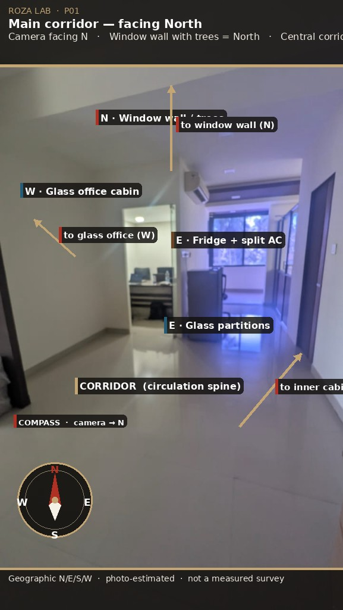

- Camera facing **N**
- Labels: Corridor, Glass office (W), Fridge + split AC (E), Glass partitions (E), Window wall (N)
- Arrows: to window wall, to glass office, to inner cabins

---

## P02 — Corridor / open plan, facing North

Same axis, glass door ajar, workstation visible in the west cabin.

**Original**

**Annotated**

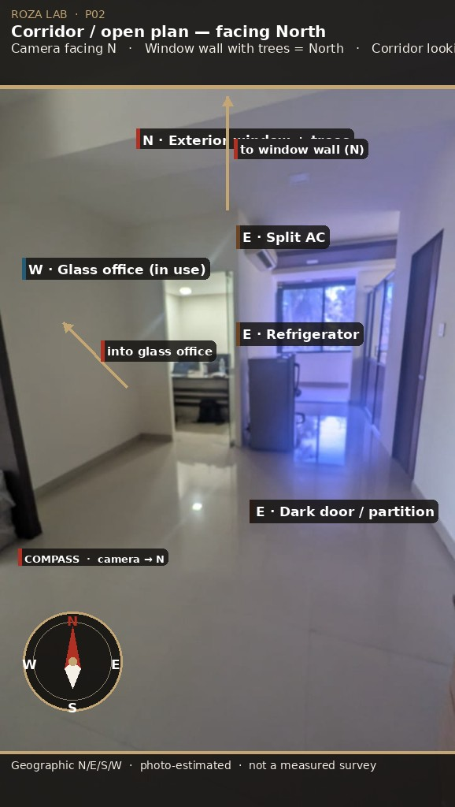

---

## P03 — Compact glass cabin, facing North

Dark executive desk, three chairs, narrow vertical window with trees, glass D-handle door on the east. Too tight for a CEO suite; assigned to Sangeetha in the proposal.

**Original**

**Annotated**

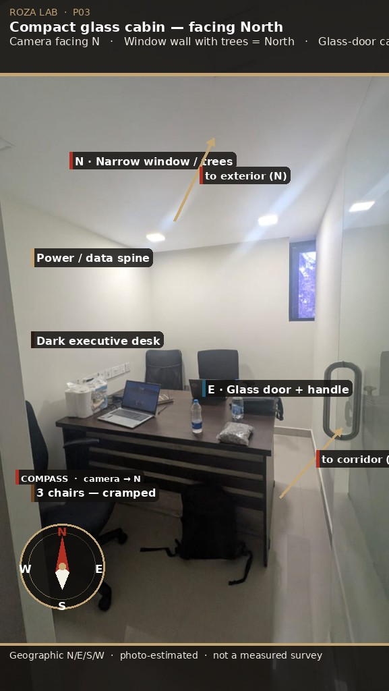

---

## P04 — Inner corridor, dark partition, facing North

White west wall, dark brown partition east, striped glass and daylight ahead (north).

**Original**

**Annotated**

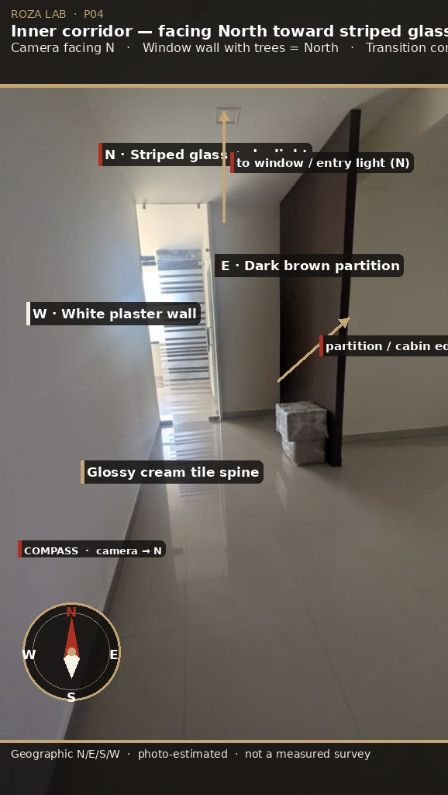

---

## P05 — Lab cabin from corridor, facing North

Black frame, walnut slats below, glass above. Red-lid jars east, microwave workstation west, blinds on the north window. This is the roastery cooking-test candidate.

**Original**

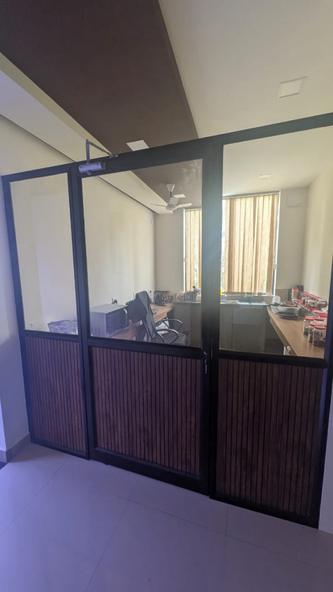

**Annotated**

---

## P06 — Lab cabin, sample library, facing North

Same room, tighter on the jar wall and door closer.

**Original**

**Annotated**

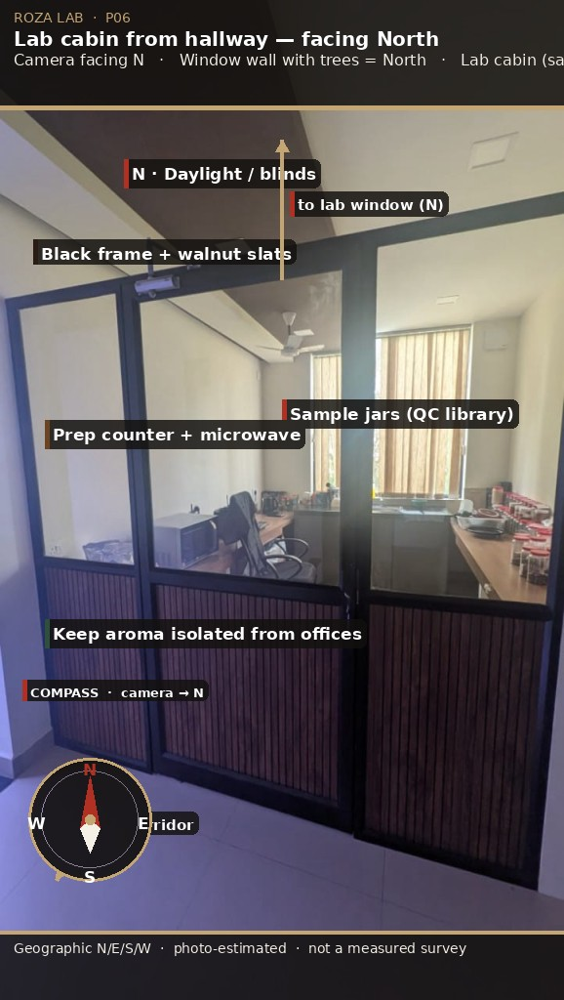

---

## P07 — Compact cabin, three chairs, facing North

Repeat of P03 confirming the cramped furniture set (desk + 3 chairs + backpack).

**Original**

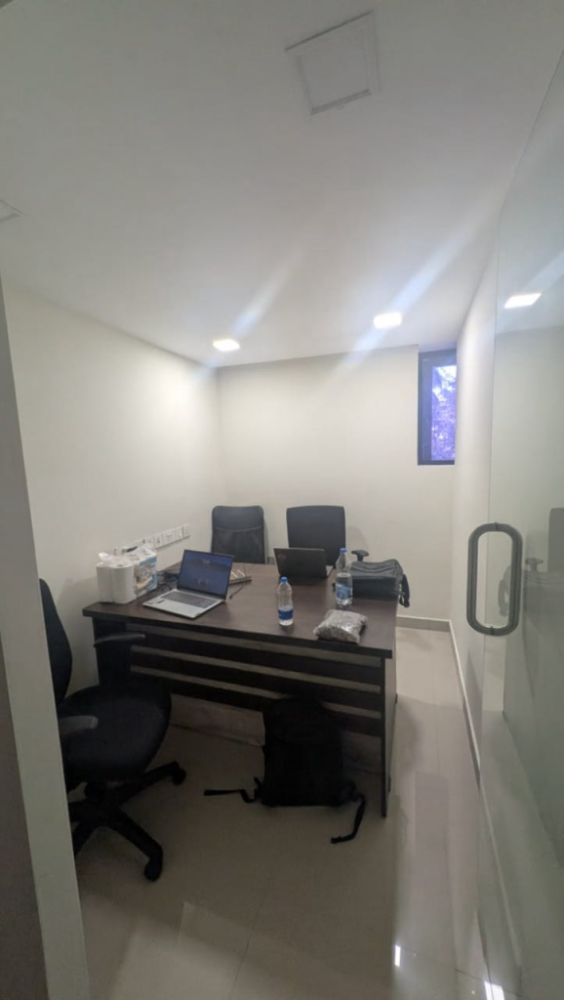

**Annotated**

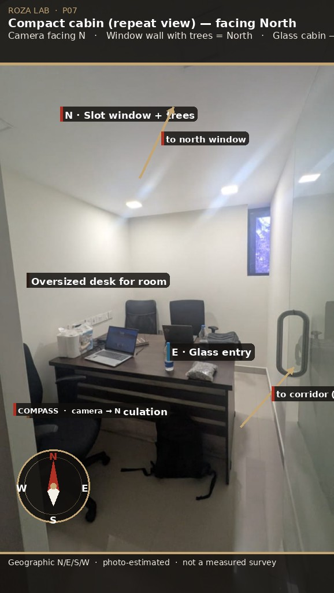

---

## P08 — Window gallery, facing North

Wood-slat ceiling, west glazing, north end window, granite threshold to the inner suite (east). Vacant except one chair. **CEO candidate zone** at the north window corner.

**Original**

**Annotated**

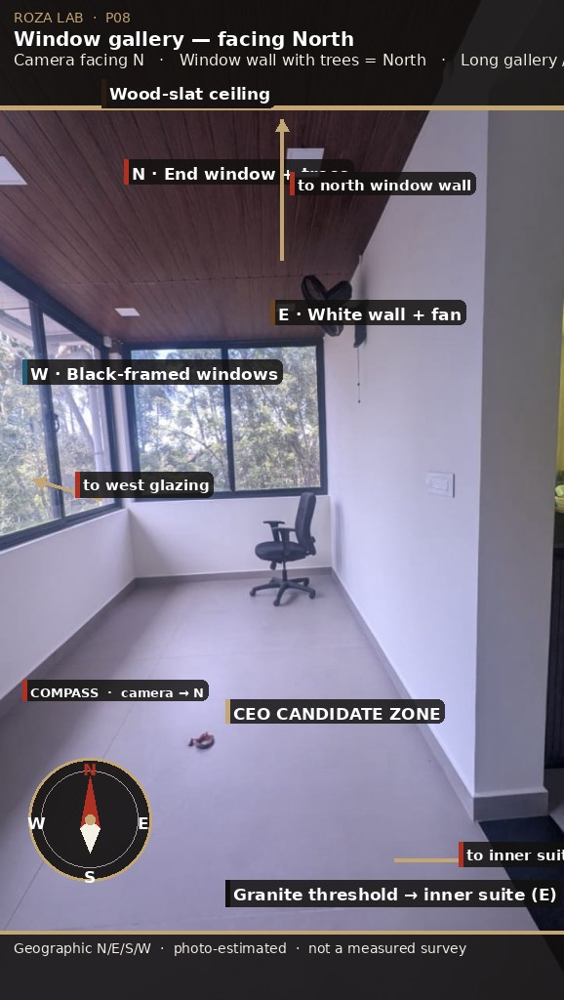

---

## P09 — Gallery looking East into the inner suite

Foreground: wood-slat ceiling (gallery). Black granite threshold. Beyond: glossy corridor, glass partition to the left (geographic **north**), AC to the right (geographic **south**).

**Original**

**Annotated**

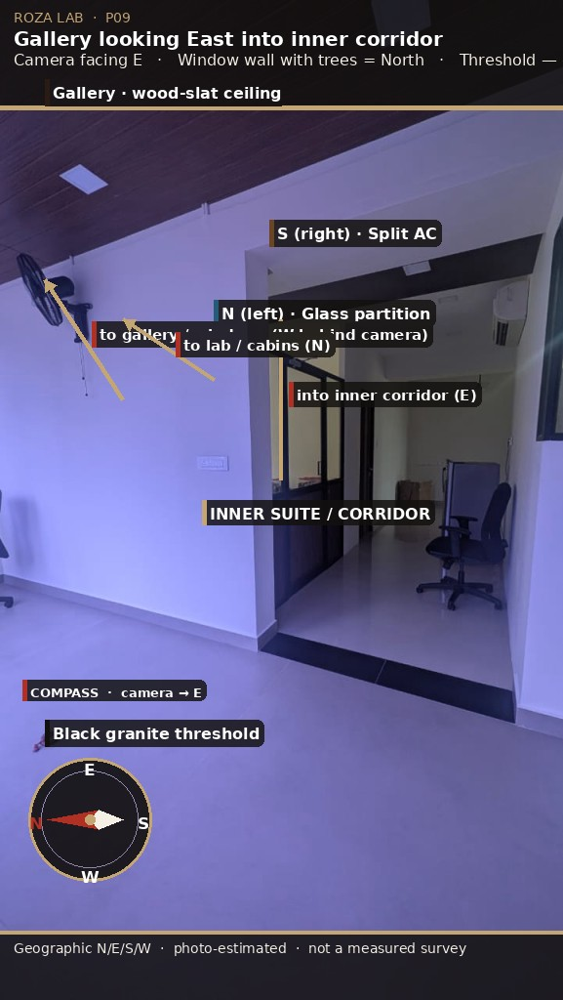

- Camera facing **E** (compass rotated: North points left on the photo)

---

## P10 — Threshold node, facing East

Primary circulation node. Future monitoring wall sits on the east side of the spine, in view of this opening.

**Original**

**Annotated**

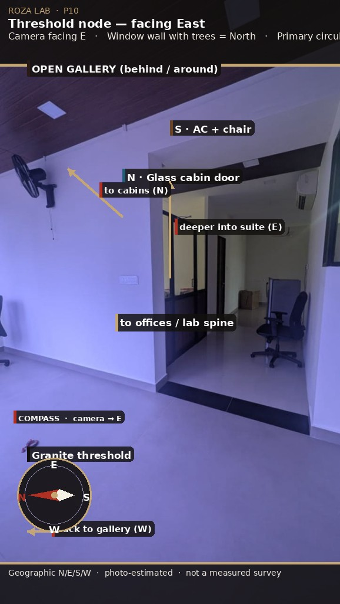

---

## P11 — Gallery long axis, facing North

Confirms west windows (left) and east white wall with fan (right). Marketing linear zone.

**Original**

**Annotated**

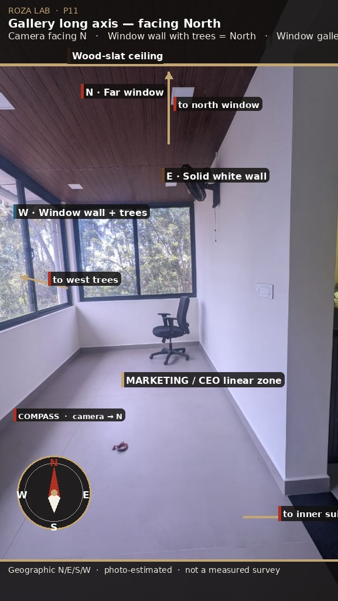

---

## P12 — Gallery reverse, facing South

Windows now on the **right** (still west). Doorway + granite on the **left** (east). Solid south end wall ahead. Compass: North is behind the camera.

**Original**

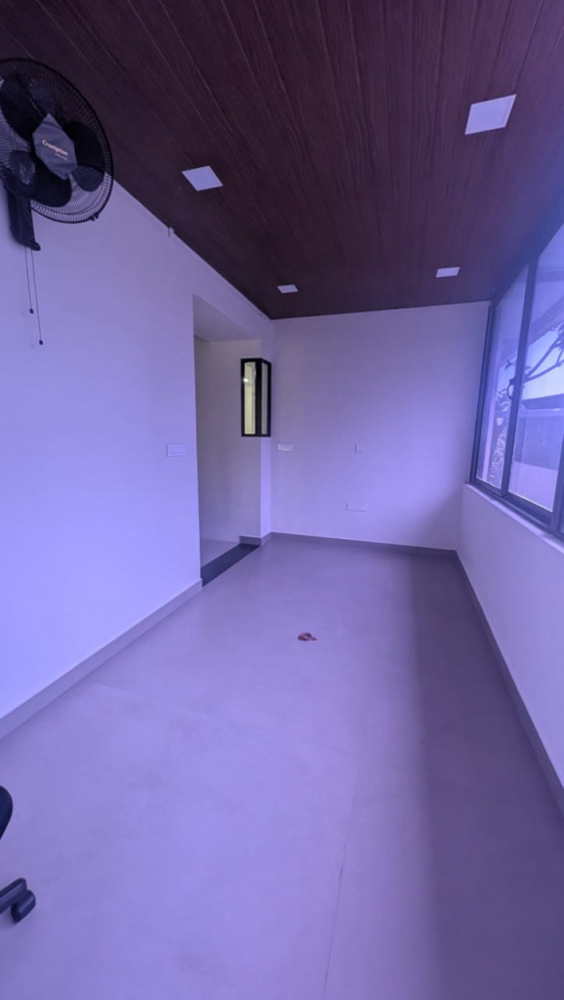

**Annotated**

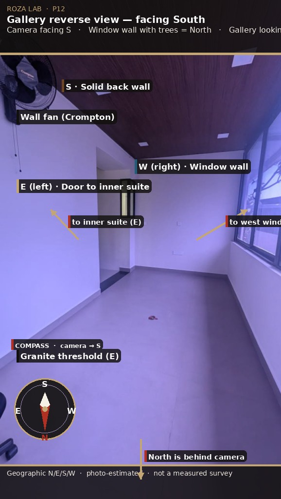

---

## P13 — Empty gallery, facing South

Thirteenth photo (hash `16c13832-…`). Vacant, fit-out ready.

**Original**

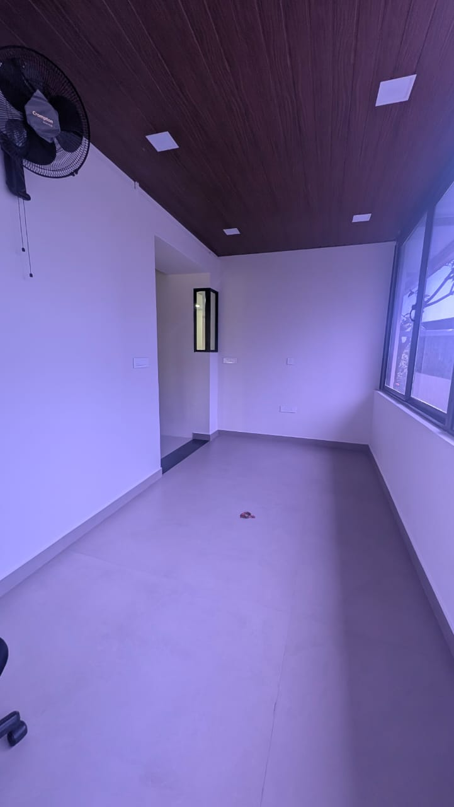

**Annotated**

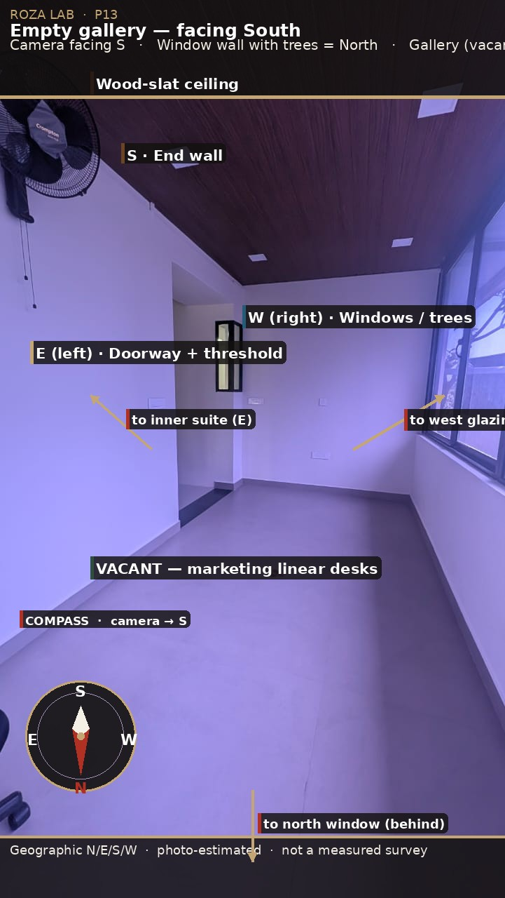

---

## Hash-named originals (provenance)

Unrenamed copies live in [`images/current/originals/`](images/current/originals/) so the document can be traced to the files attached to the task.

| Survey name | Original filename |
|---|---|
| P01 | `e8acd304-90fe-442a-97bd-2090052adc13.jpg` |
| P02 | `5f3dec56-d61d-4556-9051-56d58ba2bac9.jpg` |
| P03 | `3f109f5a-196f-46a1-b4e0-116515d6f525.jpg` |
| P04 | `a59f8d44-2e2b-443b-bca3-962ba1f1f003.jpg` |
| P05 | `c6e56543-6619-4a1f-bfe8-def7064e6074.jpg` |
| P06 | `7b745c99-ef3e-4d91-9d99-bcb1cdc725d2.jpg` |
| P07 | `10a6ab4c-07bc-44d3-b6e5-3cb625ba9828.jpg` |
| P08 | `dd4b80d3-4949-44e4-b96f-bb147a325c15.jpg` |
| P09 | `2d3e378c-6bee-44d5-9e37-8e2e0d7f6024.jpg` |
| P10 | `13d6bde0-d9af-461e-9d35-7688d56c4305.jpg` |
| P11 | `4ce4fd53-0f12-4cdf-bb45-f481b5c2a0d3.jpg` |
| P12 | `e38c5f61-9c20-4271-9b9e-b785c86ce581.jpg` |
| P13 | `16c13832-2a0d-4ec4-a40b-f8ec73feec53.jpg` |

Next: [02 — Space program](02-space-program.md).
