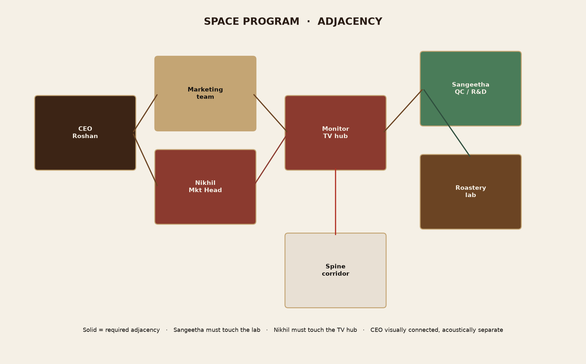

# 02 — Space program

Photo-estimated quantities. Confirm on site before procurement.

Envelope from the reconstructed plan: about **11.2 m east–west × 12.3 m north–south ≈ 138 m²**. Individual rooms below are qualitative, from corridor width vs gallery width vs furniture crowding.

## Rooms

| Zone | Photo-est. m² | Existing character | Proposed occupant | Notes |
|---|---:|---|---|---|
| Window gallery (full) | ~30 | Wood-slat ceiling, west + north glass, vacant | Split: CEO north + marketing south | Narrow; linear furniture only |
| CEO bay (north gallery) | ~9 | Same gallery, end window | **Roshan Mahamood** | Glass / film separation from marketing |
| Marketing bay | ~18 | Vacant gallery | Marketing team + **Nikhil** at threshold | Desks along west sill |
| Main corridor spine | ~28 | Glossy tile, fridge, AC | Keep clear | Relocate fridge |
| Glass cabin | ~8 | Dark desk, 3 chairs, slot window | **Sangeetha** | Adjacent to lab, not inside it |
| Lab cabin | ~12 | Slat+glass, jars, sink, microwave | Roastery cooking / testing | Extract + fire (ch. 06) |
| East glass partitions | ~12 | Glass rooms off spine | Campaign store + huddle | Keep frames |
| East dark-partition / striped glass | ~12 | P04 zone | Monitoring TV wall + ops | Acoustic felt |
| South support | ~12 | Boxes, spare chair | Fridge, print, waiting | Off-spine utility |

Headcount this program is sized for: CEO, Marketing Head, QC specialist, **3–4** marketers, intermittent lab testers, occasional visitors. Not a full factory floor.

## People and work modes

| Person | Work mode | Acoustic | Daylight | Adjacency must-have |
|---|---|---|---|---|
| Roshan Mahamood | Calls, review, visitors (2) | High — private | High — north trees | Visual connection to gallery, not to lab aroma |
| Nikhil | Campaigns + live ops | Medium | Medium | **Monitoring wall** + marketing team |
| Sangeetha | Specs, logs, sample pass | Medium | Medium (slot window) | **Shared wall / door to lab**, stay out of heat |
| Marketing team | Content, planning | Low–medium | High — west glass | Brand wall, storage |
| Lab testers | Heat, aroma, water, jars | Isolated | North-ish lab window | Extract, sink, fire |

## Adjacency rules

1. **Sangeetha touches the lab.** Pass-through shelf or hatch for jars. She does not sit at the cooktop.
2. **Nikhil touches the TV hub.** One glance to CCTV + KPI without leaving the marketing zone.
3. **CEO is at the north window.** Prestige + quiet. Privacy film on any glass to the gallery.
4. **Aroma and heat stay in the lab.** Door closed, extract on, no open path into CEO or marketing.
5. **Spine stays a spine.** No fridge, no storage towers, no TV wall in the walking lane.

## Qualitative widths (from photos, not tape)

| Space | Feel | Implication |
|---|---|---|
| Main corridor | Two people can pass; fridge already pinches one side | Remove fridge; keep ≥ 1.2 m clear |
| Window gallery | One desk + aisle, not two facing rows | Single-loaded desks on the west sill, brand wall on east |
| Glass cabin | Desk fills the room | Replace oversized executive desk with a slimmer QC bench |
| Lab cabin | Counters on three sides, one chair | Keep perimeter counters; no extra seating |

## Daylight and glare

- North corridor window and north gallery window: stable daylight, good for CEO and the spine terminus.
- West gallery glazing: strong lateral light, tree views, possible afternoon heat — keep the existing wall fan, add solar film if needed, do not put glossy TV screens opposite west glass without a hood or felt surround.
- Lab blinds already manage glare on jars and water.

## What not to program

- No large boardroom (the east huddle is four people).
- No open kitchen in the corridor.
- No second roaster in the gallery (aroma + fire risk).
- No CEO desk in the current three-chair glass cabin — it photographs as cramped and lacks presence.

Next: [03 — Proposed layout](03-proposed-layout.md).
