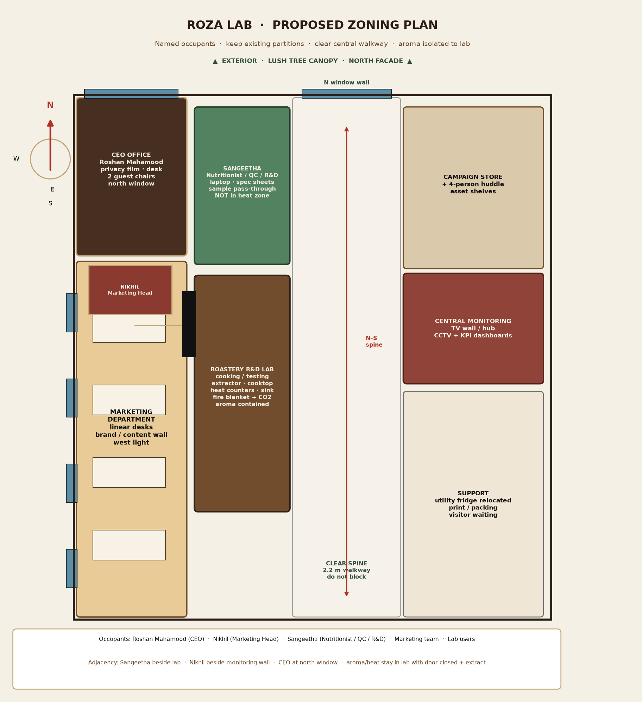
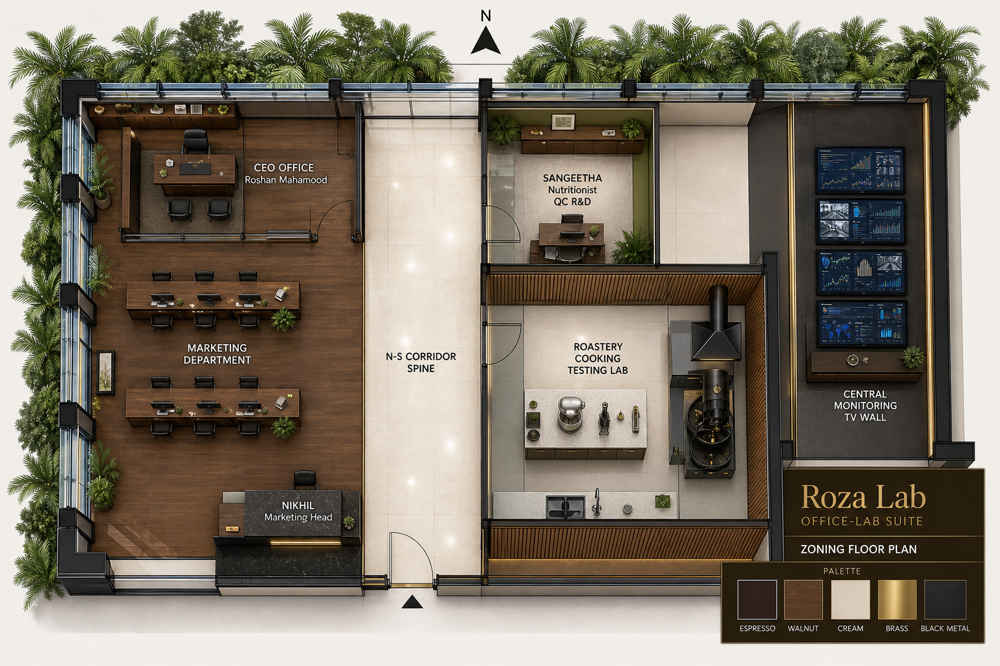
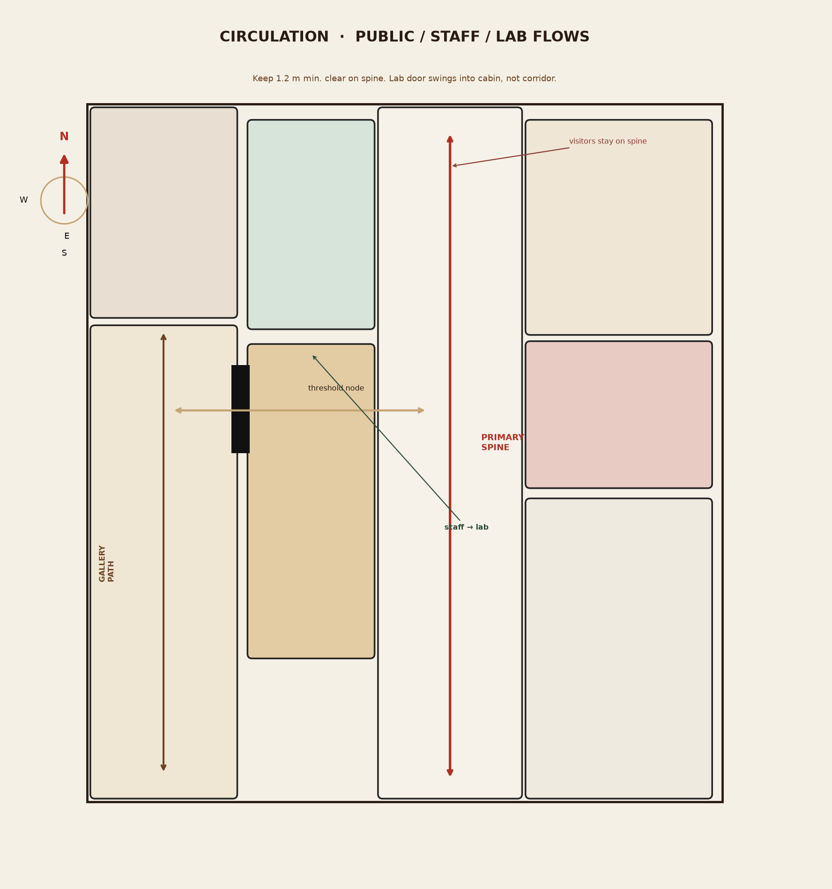
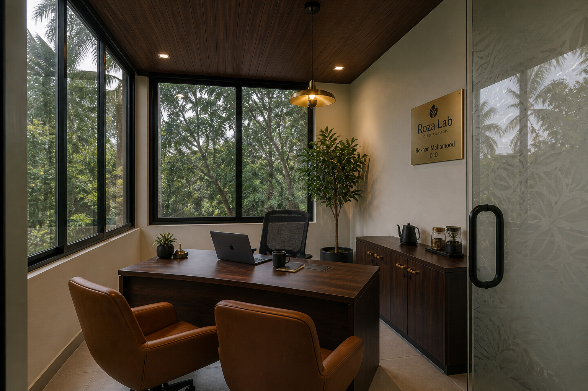
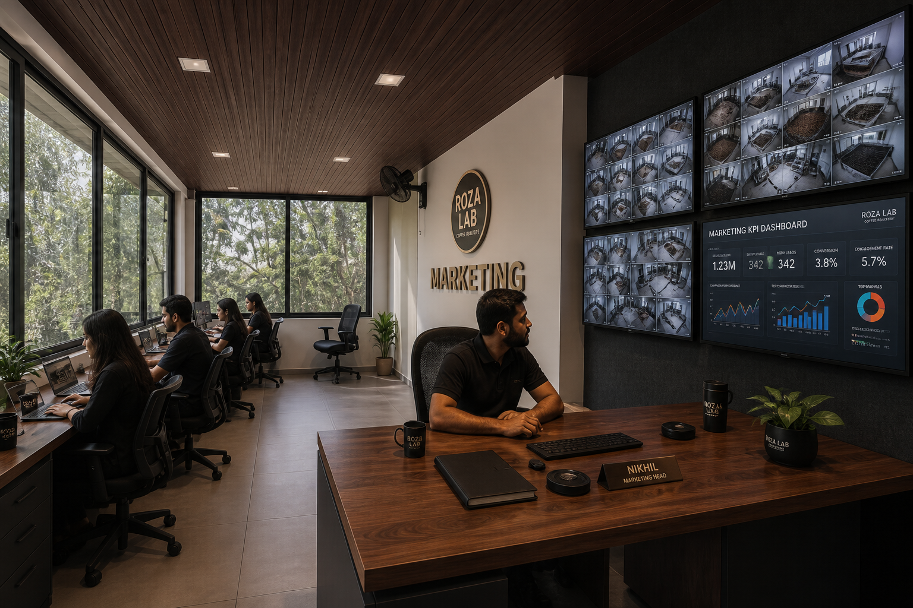
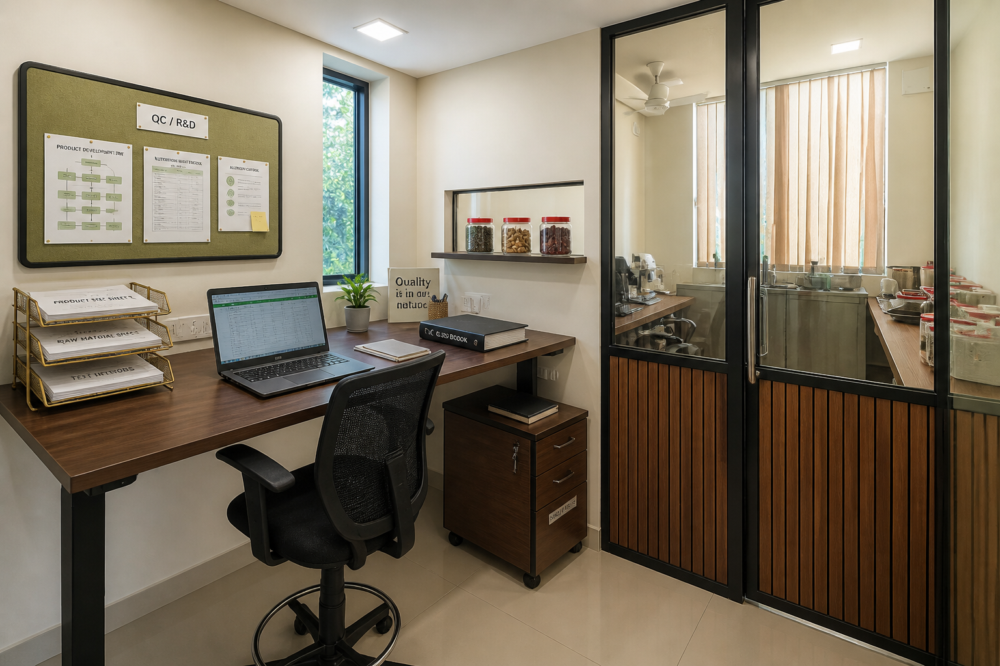
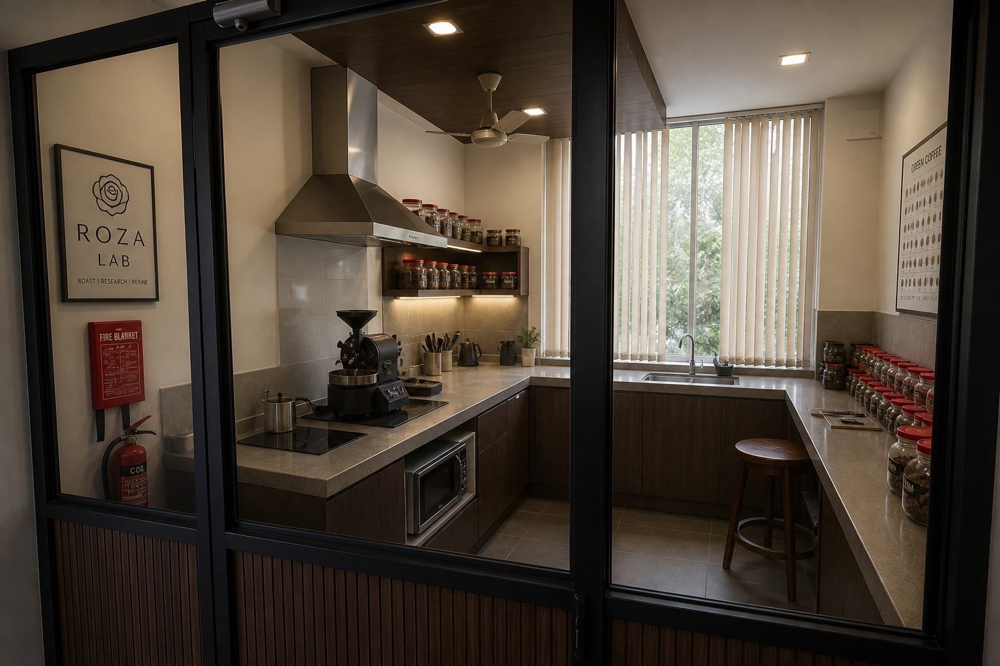
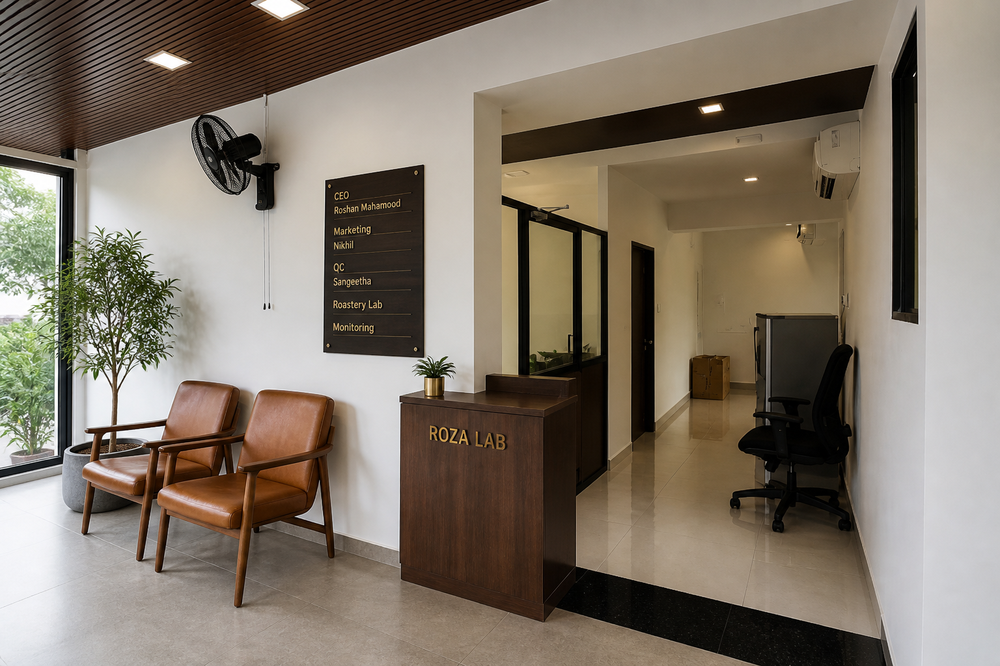
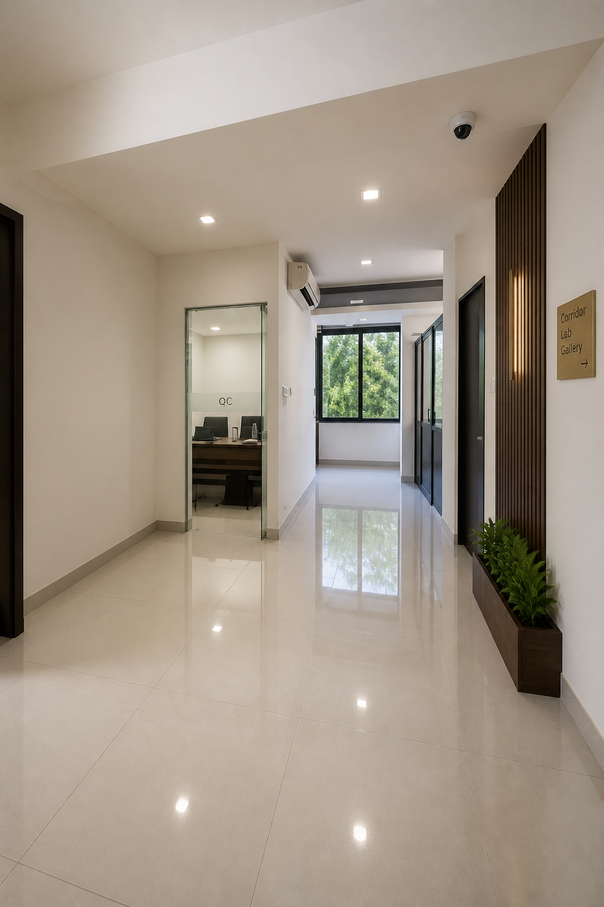

# 03 — Proposed layout

Keep the existing bones: glass partitions, wood-slat lab cabin, wood-slat gallery ceiling, black frames, granite threshold, corridor tile. Re-assign rooms and clear the spine.

---

## Named workspaces

### CEO office — Roshan Mahamood

**Where:** North end of the window gallery (P08 north window corner).  
**Enclosure:** New glass / walnut-slat screen with privacy film, aligned to an existing ceiling-slat joint so the gallery still reads as one volume from outside.  
**Fit-out:** Executive desk facing the entry, two guest chairs, credenza, quiet for calls.

Why not the existing glass cabin? That room is already undersized for three chairs and a full-width desk (P03/P07). The gallery north corner is the prestige location the brief asked for.

### Marketing Head — Nikhil

**Where:** South of the CEO screen, at the granite threshold, sightline to the east TV wall.  
**Fit-out:** Slightly larger desk, dual monitors, campaign shelf behind.

He sits with the team but owns the monitoring glance.

### Marketing department

**Where:** Remainder of the west gallery (P11–P13).  
**Fit-out:** Single-loaded desks along the west sill, content / brand wall on the east plaster, lockable asset storage at the south end.

### Nutritionist / QC / R&D — Sangeetha

**Where:** Existing compact glass cabin, adjacent to the lab, **not** inside the heat zone.  
**Fit-out:** Slimmer desk, sample pass-through toward the lab, QC logs, olive accent pinboard.

### Roastery cooking testing research

**Where:** Existing wood-slat lab cabin (P05/P06).  
**Fit-out:** Heat counters, extractor, cooktop, jar library, sink retained. Full spec in [06](06-roastery-rd-lab.md).

### Central TV monitoring

**Where:** East wall of the inner suite, visible from the threshold (P09/P10).  
**Fit-out:** 3–4 wall screens (CCTV grid + KPI), acoustic felt, NVR in a ventilated cupboard. Coverage in [05](05-monitoring-av.md).

### Reception / entry node

The granite threshold is already a ceremonial strip. Add a small walnut ledge, directory, and two waiting chairs — not a hotel lobby.

### Corridor spine

Fridge off the walking lane. Brass wayfinding. Dome camera. North window kept as the visual terminus.

---

## Circulation

| Flow | Path | Rule |
|---|---|---|
| Visitors | South entry → spine → threshold → CEO or waiting | Do not route visitors through the lab |
| Marketing | Gallery path, west of granite | Stay out of lab |
| QC | Spine → Sangeetha cabin → lab door | Samples move through the pass-through |
| Services | Spine only | No storage in the 2.2 m walkway |

Lab door swings **into** the cabin. Minimum clear spine **1.2 m**; photo-estimated width is larger if the fridge moves.

---

## Phasing

| Phase | Scope | Why first |
|---|---|---|
| **1** | Relocate fridge; Sangeetha desk; Nikhil + marketing desks; TV wall; corridor/entry cameras | Ops and people can work immediately |
| **2** | Lab extract, cooktop circuit, washable counters, fire kit | Depends on MEP |
| **3** | CEO enclosure, privacy film, executive furniture, optional private camera | Can wait without blocking the team |

---

## Zone table (existing → proposed)

| Zone | Occupant | Function | Existing photo | Proposed image |
|---|---|---|---|---|
| N gallery | Roshan Mahamood | CEO | [P08](images/annotated/08-window-gallery-facing-north-annotated.jpg) | [CEO](images/proposed/proposed-ceo-roshan-mahamood.png) |
| W gallery | Marketing + Nikhil | Team + head | [P11](images/annotated/11-gallery-windows-west-annotated.jpg) | [Marketing](images/proposed/proposed-marketing-monitoring-nikhil.png) |
| Threshold | Nikhil / visitors | Ops node | [P09](images/annotated/09-gallery-threshold-to-inner-annotated.jpg) | [Reception](images/proposed/proposed-reception-threshold.png) |
| Glass cabin | Sangeetha | QC / R&D | [P03](images/annotated/03-glass-cabin-executive-desk-annotated.jpg) | [QC desk](images/proposed/proposed-sangeetha-qc-rd.png) |
| Lab cabin | R&D | Cooking tests | [P05](images/annotated/05-lab-cabin-from-corridor-annotated.jpg) | [Lab](images/proposed/proposed-roastery-rd-lab.png) |
| Corridor | All | Spine | [P01](images/annotated/01-corridor-facing-north-annotated.jpg) | [Corridor](images/proposed/proposed-corridor-to-window.png) |
| East wall | Ops | TV hub | [P10](images/annotated/10-threshold-inner-suite-annotated.jpg) | [Monitoring](images/proposed/proposed-marketing-monitoring-nikhil.png) |

Next: [04 — Furniture and materials](04-furniture-materials.md).
