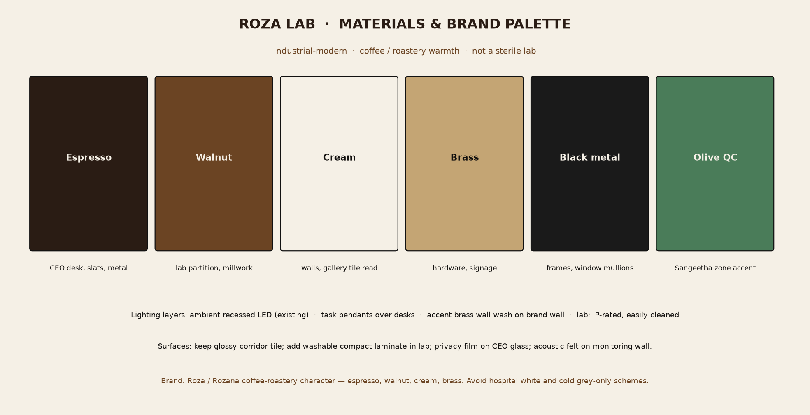

# 04 — Furniture, materials, lighting, branding

Industrial-modern, coffee-roastery warmth. Elevate what is already there (black metal, walnut slats, cream plaster). Do not restyle as a hospital or a hotel.

## Palette

| Name | Role | Where |
|---|---|---|
| Espresso | Depth | CEO desk, slat screens, metal returns |
| Walnut | Existing language | Lab partition, millwork, gallery ceiling (keep) |
| Cream | Light | Walls, corridor tile (keep) |
| Brass | Accent only | Handles, signage, task lamps — not gold-everywhere |
| Black metal | Structure | Keep window mullions and cabin frames |
| Olive QC | Wayfinding | Sangeetha zone only |

## FF&E schedule (modules)

Borrowed from a *react-planner* style module list: few SKUs, repeated.

| Code | Item | Qty | Zone | Notes |
|---|---:|---|---|---|
| D-CEO | Executive desk 1800×800 walnut | 1 | CEO | Face the door, window to occupant's side |
| C-GUEST | Guest chair, cognac leather | 2 | CEO | Not matching the mesh task chair |
| C-TASK | Mesh task chair (reuse existing black) | 6–8 | All desks | Existing chairs are usable |
| D-MKT | Linear desk 1400×700 | 3–4 | Gallery | Single-loaded on west sill |
| D-NIK | Desk 1600×700 + dual-monitor arm | 1 | Threshold | Sightline to TVs |
| D-QC | Slim QC bench 1400×600 | 1 | Glass cabin | Replace oversized exec desk |
| SH-PASS | Pass-through jar shelf | 1 | QC / lab wall | Lockable, fire-safe side toward lab |
| TV-HUB | 43–55″ commercial displays | 3–4 | East wall | See ch. 05 |
| ST-BRAND | Pin / shelf brand wall | 1 | Gallery east plaster | Campaign assets |
| ST-CAMP | Lockable tall cupboard | 2 | East huddle | Printed assets, samples for shoots |
| R-WAIT | Waiting chairs | 2 | Threshold | Match CEO guest leather, smaller |
| L-PEND | Brass/black pendant | 2 | CEO + Nikhil | Task layer |
| PLANT | Floor ficus / olive | 3 | Gallery + threshold | Soften glass |

Reuse: existing black mesh chairs, lab jar library, lab sink, split ACs, gallery wall fan, recessed LED panels.

Remove / relocate: corridor fridge → south support; extra guest chairs in the glass cabin; microwave off the lab worktop.

## Surfaces

| Surface | Action |
|---|---|
| Corridor glossy tile | Keep. Do not cover. High-contrast rugs would slip. |
| Gallery matte tile | Keep. |
| Lab counters | Replace or overlay with **heat-resistant compact laminate** or stainless at the cooktop bay only |
| Lab splashback | Washable sheet (stainless or compact laminate) |
| CEO glass | Frosted / coffee-leaf **privacy film**, clear at head height optional |
| Monitoring wall | Acoustic felt in espresso, brass screen frames |
| Gallery east wall | Brand wall: walnut slat or felt + brass letters **ROZA / MARKETING** |

## Lighting layers

| Layer | Existing | Add |
|---|---|---|
| Ambient | Recessed square LED panels (corridor, cabins, gallery) | Leave; re-lamp to 3000–3500 K if currently too cool |
| Task | None dedicated | Pendants at CEO and Nikhil; under-shelf LED at QC; IP-rated battens in lab |
| Accent | Tree daylight | Brass wall-wash on brand wall; small picture lights on directory |
| Control | Wall switches (visible in gallery) | Lab extract interlock with cooktop; TV wall on a dedicated switch |

Avoid cool-blue “clinic” LEDs in CEO and marketing. Lab can stay slightly cooler for colour of samples.

## Branding

- Directory at the granite threshold: **Roza Lab** plus the four named rooms.
- Brass letters, not vinyl stickers.
- Campaign photography on the brand wall may use HUBB / Rozana product work already in this repo — label generated campaign art as concepts if used.
- Do not paint the wood-slat ceiling. It is the strongest existing material.

## MEP notes (furniture-adjacent)

- Extra 13A/20A at TV wall and Nikhil desk.
- Data: 2× Cat6 at every desk, 1× at TV NVR.
- Lab: see [06](06-roastery-rd-lab.md).
- Do not put floor boxes in the glossy corridor walking lane.

Next: [05 — Monitoring and AV](05-monitoring-av.md).
