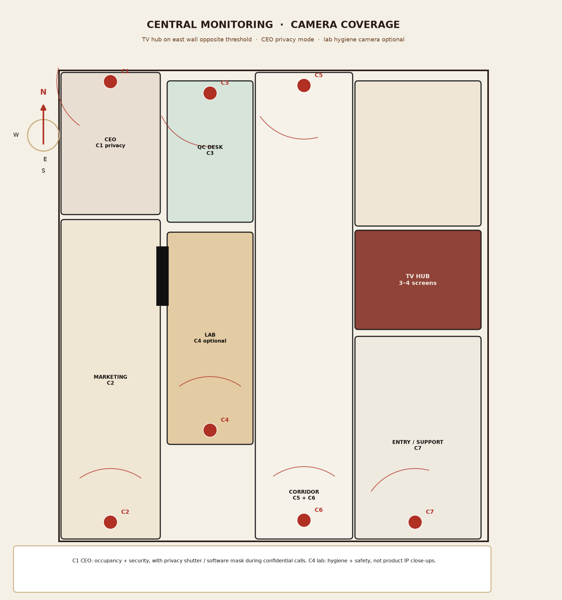

# 05 — Central monitoring and AV

A wall of TVs that can see the suite, plus optional marketing KPIs. This is an **ops hub**, not a casino CCTV room. Acoustic felt, brass frames, and a normal desk in front of it (Nikhil).

Method note: device-on-plan overlay follows the idea in [ha-floorplan](https://github.com/ExperienceLovelace/ha-floorplan) — cameras and screens are first-class objects on the drawing, not a separate spreadsheet.

## Hub location

**East wall opposite the granite threshold** (visible in P09/P10). Reasons:

- One glance from Nikhil’s desk and from anyone arriving at the node.
- Not in the CEO sightline all day.
- Not opposite west sun (gallery glass) if the wall is in the inner suite.
- Cable run to an NVR cupboard in south support is short.

**Screens (3–4):**

| Screen | Default | Notes |
|---|---|---|
| 1 | Corridor + entry grid (C5, C6, C7) | Always on during staffed hours |
| 2 | Gallery + marketing (C2) | Occupancy / security |
| 3 | Lab + QC door (C3, C4) | Safety; C4 optional |
| 4 | KPI / campaign dashboard | Browser or HDMI from Nikhil’s PC; mute if confidential |

PoE NVR in a **ventilated, lockable** cupboard. No NVR in the ceiling void (service access).

## Camera coverage

| ID | Room | Purpose | Privacy |
|---|---|---|---|
| C1 | CEO | Occupancy / after-hours security | **Privacy mode** — hardware shutter or software mask during calls; default off during the day if Roshan prefers |
| C2 | Marketing gallery | Coverage of long vacant-today space | Wide lens, no screen close-ups of laptops |
| C3 | QC cabin door / Sangeetha | Entry to R&D | No zoom on documents |
| C4 | Lab | Fire, extract, unattended cooktop | Optional. Hygiene + safety, **not** product-IP close-ups of recipes |
| C5 | Corridor north | Spine + window wall | Primary |
| C6 | Corridor south | Spine + entry direction | Primary |
| C7 | Support / entry | Visitors, fridge, packing | Primary |

Mount: small black domes on white ceilings, aligned with LED grids. Do not hang cameras on the wood-slat ceiling without a block that matches the slats.

## Privacy note — CEO office

The brief asks for TV monitoring of the **entire** office and also a private CEO room for calls. Resolve it this way:

1. C1 is **optional** and defaults to **privacy shutter closed** during work hours.
2. After-hours or when the office is empty, C1 may open on a schedule or a key-fob.
3. No microphone in the CEO office.
4. Privacy film on CEO glass is the primary visual privacy; CCTV is secondary.

Sangeetha’s logs and the lab jar labels are business-sensitive. C3/C4 must not be advertised as a way to read QC paperwork off a screen.

## Power and data

| Load | Note |
|---|---|
| 4× commercial TVs | Dedicated 20A or 2× 13A on a labelled breaker |
| NVR + PoE switch | UPS 15–30 min |
| Desk HDMI / USB-C | Nikhil can throw a deck to screen 4 |
| Cat6 | Cameras PoE; one data outlet at the hub |

Coordinate extract (lab) so a fault overlay can appear on screen 3 later if a simple current-sensor is added. Not required in Phase 1.

## What not to do

- Do not put the TV wall in the west gallery facing the trees (glare, and it turns marketing into a control room).
- Do not monitor toilets or prayer space if any are added later.
- Do not live-stream internally without an access list.

Next: [06 — Roastery R&D lab](06-roastery-rd-lab.md).
