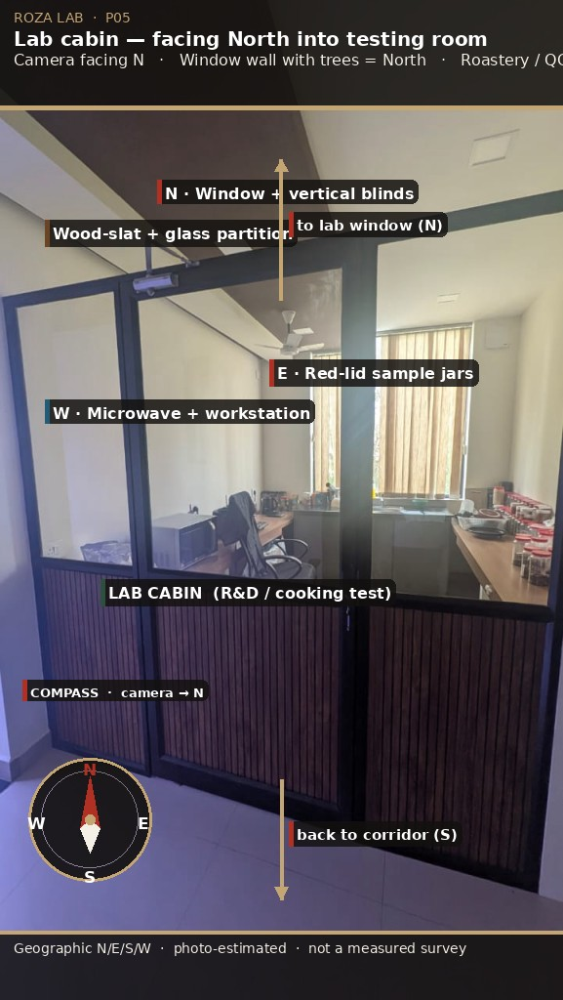

# 06 — Roastery cooking / testing lab

The existing wood-slat + glass cabin (P05, P06) is already a QC kitchen: red-lid jar library, sink, microwave, north-ish window with blinds. Keep the enclosure. Upgrade it for **heat, aroma, fire, and wash-down**. Sangeetha stays next door, not at the cooktop.

## Intent

Small research operation for **roastery cooking tests** (sample roast, pan/cooktop trials, tasting notes) supporting the Rozana / HUBB food brand. Not a production roastery. Batch size stays sample-scale.

## Keep / change

| Existing | Action |
|---|---|
| Black metal frame + walnut slats + glass | Keep — this is the brand |
| Red-lid jars | Keep; organise on labelled walnut shelves by SKU / roast date |
| Stainless sink at the window | Keep; add a proper trap and splashback |
| Microwave on the counter | Relocate **under** counter |
| Office chair in the heat bay | Remove; one stool only, away from the cooktop |
| Ceiling fan + recessed LED | Keep fan; add task light at cooktop |
| Blinds | Keep for glare on glass jars |

## Heat and extract

- **Cooktop / sample roaster zone** on the west or rear counter (away from the corridor glass so flame is not in the public view).
- Stainless **canopy extractor** with grease filter, ducted to exterior (north or west facade — confirm landlord). Recirculating carbon is a fallback only; aroma isolation from CEO/marketing is a stated requirement.
- Makeup air: door undercut is not enough once extract is on; a slim transfer grille high in the corridor wall, fire-dampened.
- Interlock: cooktop circuit drops if extract fails (simple air-flow paddle or current sensor).

## Surfaces and hygiene

- Heat-resistant compact laminate or stainless at the hot bay; existing light-oak counters may remain at the jar bay if they are not beside the flame.
- Washable splashback full length of the wet + hot run.
- Floor: existing tile is acceptable if sealed grout; add a removable anti-fatigue mat that can be hosed in the support room, not a porous rug.

## Fire and safety

| Item | Spec |
|---|---|
| Extinguisher | CO₂ or wet chemical **rated for cooking oils / electrical**, not a random powder unit dumped on jars |
| Fire blanket | Adjacent to cooktop, marked |
| Call point / smoke | Confirm existing suite detectors; add a heat detector in the cabin (smoke detectors nuisance-trip on roast) |
| First aid | On Sangeetha’s side of the wall, not above the flame |
| No deep-fat production | Sample sauté / roast only |

Door closer already exists — keep it, and add a sign: **keep closed when testing**.

## Power

- Dedicated cooktop / small roaster circuit (confirm load; many sample roasters are 2–3 kW).
- GFCI/RCD on the wet counter.
- Spare sockets off the splashback, not behind the jar row.

## Sample flow with Sangeetha

1. Jars live in the lab library.
2. Pass-through shelf in the shared wall (lockable from lab side).
3. Sangeetha logs, specs, and laptop stay in the glass cabin (olive QC zone).
4. Tasting cups may sit on her bench; hot equipment may not.

## Aroma isolation

CEO (north gallery) and marketing (west gallery) share air with the inner suite through the granite opening. The lab must **not** dump roast air into the spine.

- Door closed + extract on during tests.
- Do not prop the lab door for “cooling.”
- Optional: simple weatherstrip on the lab door.

## Phase 2 checklist

- [ ] Landlord approval for extract duct
- [ ] Cooktop / sample roaster SKU and kW
- [ ] Fire kit installed before first hot test
- [ ] Sangeetha pass-through built
- [ ] Microwave under counter
- [ ] Jar labels + date system
- [ ] SOP: unattended cooktop prohibited; C4 camera optional for that rule

This completes the specification. Return to the [pack index](README.md).
