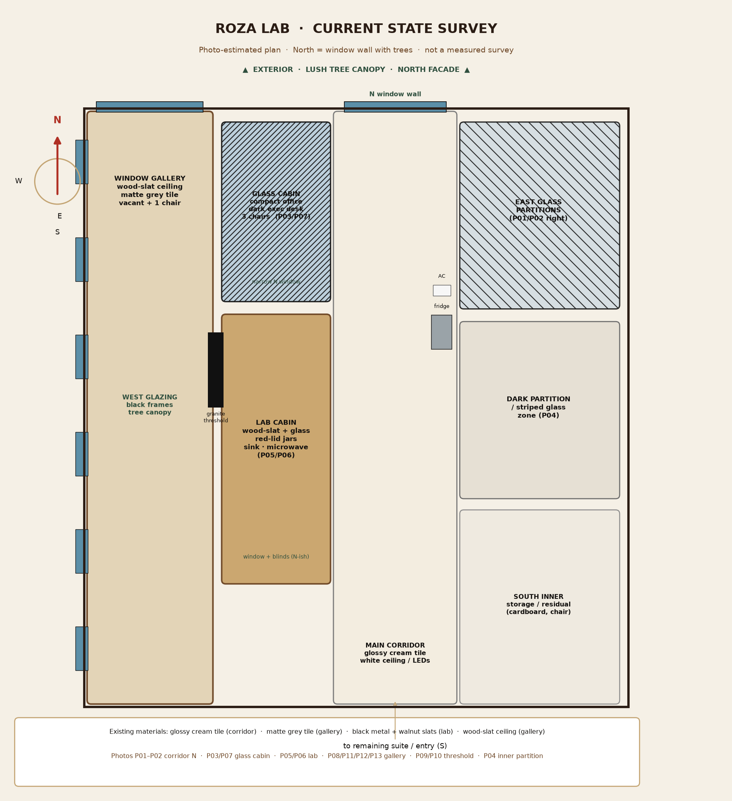

# Roza Lab — Interior Design Pack

A visual interior-design package for the **Roza Lab** suite: marketing, central monitoring, and a small roastery cooking / QC research operation.

This pack sits beside the HUBB storefront in this repository. It does **not** change the public website. It documents the physical office-lab from owner-supplied photographs and proposes a named-occupant fit-out.

## How to read this pack

Read in order. Every chapter embeds images so the survey is visible on GitHub.

| Order | File | What you get |
|:---:|---|---|
| 0 | This README | Assumptions, north rule, occupant map, GitHub methods |
| 1 | [01-current-survey.md](01-current-survey.md) | All 13 current photos with **N/E/S/W compass**, camera facing, zone labels, and arrows |
| 2 | [02-space-program.md](02-space-program.md) | Rooms, people, photo-estimated m², adjacency |
| 3 | [03-proposed-layout.md](03-proposed-layout.md) | Zoning plan, circulation, named offices |
| 4 | [04-furniture-materials.md](04-furniture-materials.md) | FF&E, finishes, lighting, branding |
| 5 | [05-monitoring-av.md](05-monitoring-av.md) | TV hub, camera coverage, privacy, MEP |
| 6 | [06-roastery-rd-lab.md](06-roastery-rd-lab.md) | Cooking / testing lab specification |

**Start here if you only have five minutes:** the zone table below, then the [proposed zoning plan](images/diagrams/02-proposed-zoning-plan.png), then chapter 01 for compass-labeled photos.

---

## North rule (used on every photo)

**Window wall with tree canopy = North.**

Applied consistently:

- The glossy corridor that ends at a large black-framed window is a **north-facing spine**.
- The long wood-slat gallery has **west glazing** (trees along the long side) and a **north end window**.
- Looking from the gallery through the black granite threshold is looking **east** into the inner suite.
- The reverse gallery views (solid back wall ahead, windows on the right) are facing **south**.

N/E/S/W labels are **geographic**, not “left/right of the camera.” A compass rose is rotated on each annotated frame so North stays north.

Dimensions are **photo-estimated, not surveyed**. Confirm with a laser measure before joinery or MEP.

---

## Occupants and proposed homes

| Occupant | Role | Proposed zone | Why |
|---|---|---|---|
| **Roshan Mahamood** | CEO | North end of the window gallery | Prestige, trees, quiet for calls, acoustic separation |
| **Nikhil** | Marketing Head | Gallery desk at the granite threshold, facing the TV hub | Runs campaigns and ops from one seat |
| **Sangeetha** | Nutritionist / QC / R&D | Existing glass cabin, door to corridor, adjacent to lab | Samples and logs without sitting in heat / aroma |
| Marketing team | Content + campaigns | Remainder of window gallery | Daylight, brand wall, linear desks |
| Lab users | Roastery cooking tests | Existing wood-slat lab cabin | Sink, jars, and window already there; add extract |

---

## Zone | occupant | function | existing photo | proposed image

| Zone | Occupant | Function | Existing | Proposed |
|---|---|---|---|---|
| Window gallery, north corner | Roshan Mahamood | Private CEO office | [P08](images/annotated/08-window-gallery-facing-north-annotated.jpg) | [Concept](images/proposed/proposed-ceo-roshan-mahamood.png) |
| Window gallery, linear desks | Marketing team | Collaborative marketing | [P11](images/annotated/11-gallery-windows-west-annotated.jpg) [P13](images/annotated/13-gallery-empty-south-end-annotated.jpg) | [Concept](images/proposed/proposed-marketing-monitoring-nikhil.png) |
| Threshold node | Nikhil | Marketing Head + ops | [P09](images/annotated/09-gallery-threshold-to-inner-annotated.jpg) | [Reception node](images/proposed/proposed-reception-threshold.png) |
| East wall at spine | Ops | Central TV monitoring | [P10](images/annotated/10-threshold-inner-suite-annotated.jpg) | [Monitoring wall](images/proposed/proposed-marketing-monitoring-nikhil.png) |
| Glass cabin | Sangeetha | QC / R&D desk | [P03](images/annotated/03-glass-cabin-executive-desk-annotated.jpg) | [Concept](images/proposed/proposed-sangeetha-qc-rd.png) |
| Lab cabin | R&D | Roastery cooking testing | [P05](images/annotated/05-lab-cabin-from-corridor-annotated.jpg) | [Concept](images/proposed/proposed-roastery-rd-lab.png) |
| Main corridor | All | Clear N–S walkway | [P01](images/annotated/01-corridor-facing-north-annotated.jpg) | [Concept](images/proposed/proposed-corridor-to-window.png) |

---

## Key drawings

### Current survey plan



### Proposed zoning


### Concept floor plan (generated)


### Materials


---

## Assumptions (stated, not measured)

- **Brand:** Roza Lab is treated as the physical workplace for the Rozana / HUBB food brand — coffee-roastery warmth (espresso, walnut, cream, brass) rather than a sterile white lab. Occupant names come from the owner brief.
- **Location character:** Upper-floor suite with tropical / lush tree views. Climate control already includes split ACs and wall fans.
- **Keep:** Glass partitions, wood-slat lab cabin, wood-slat gallery ceiling, black window frames, granite threshold, corridor tile.
- **Move:** Corridor refrigerator (off the spine, into support), surplus chairs in the glass cabin, microwave off the lab worktop and under-counter.
- **Do not block** the central corridor. Target **≥ 1.2 m** clear walking width; photo-estimated spine is ~2.2 m.

---

## GitHub methods used (methodology, not cloned models)

Searched 2026-09-07 via GitHub. We borrowed **process**, not unmaintained CV pipelines.

| Repository | Stars (approx.) | What we borrowed |
|---|---:|---|
| [cvat-ai/cvat](https://github.com/cvat-ai/cvat) | 16,654 | Zone inventory from photos: every frame labeled, leaders to objects, consistent class names (corridor, lab, gallery) |
| [pascalorg/editor](https://github.com/pascalorg/editor) | 22,003 | North-oriented architectural plan as the primary artefact; parametric zones before furniture |
| [cvdlab/react-planner](https://github.com/cvdlab/react-planner) | 1,476 | Furniture as repeatable modules (desk, guest pair, TV wall) placed on a 2D plan |
| [ExperienceLovelace/ha-floorplan](https://github.com/ExperienceLovelace/ha-floorplan) | 1,601 | Map devices (cameras, TVs, AC) onto the floor plan rather than listing them in prose only |
| [AlpacaLabsLLC/skills-for-architects](https://github.com/AlpacaLabsLLC/skills-for-architects) | 345 | Workplace program: occupant, function, adjacency, FF&E, phased fit-out |
| [siegblink/interior-designer-ai](https://github.com/siegblink/interior-designer-ai) | 213 | Photo → concept visual workflow (existing room photo as reference for a proposed interior) |

A lightweight Python pass (Pillow + matplotlib) annotates compass/arrows and draws plans. Brightness heuristics (brightest band/column) **support** window location; tree views can be darker than sunlit plaster, so labels are human-authored, not auto-detected rooms.

Scripts: [`scripts/annotate_current.py`](scripts/annotate_current.py), [`scripts/generate_diagrams.py`](scripts/generate_diagrams.py).

---

## Folder map

```
docs/roza-lab-interior/
  README.md                          ← you are here
  01-current-survey.md
  02-space-program.md
  03-proposed-layout.md
  04-furniture-materials.md
  05-monitoring-av.md
  06-roastery-rd-lab.md
  images/current/                    originals (named + hash copies)
  images/annotated/                  compass + labels on every photo
  images/proposed/                   generated concept interiors
  images/diagrams/                   plans, palette, CCTV, adjacency
  scripts/                           regenerate annotations and diagrams
```

Re-run locally:

```bash
python3 -m pip install -r docs/roza-lab-interior/scripts/requirements.txt
python3 docs/roza-lab-interior/scripts/annotate_current.py
python3 docs/roza-lab-interior/scripts/generate_diagrams.py
```

---

## Phased fit-out (budget order)

1. **Phase 1 — desks + monitoring:** relocate fridge, Sangeetha desk, Nikhil + marketing desks, TV wall, cameras C5–C7 (corridor / entry).
2. **Phase 2 — lab:** extractor, cooktop circuit, washable counters, fire kit, jar library.
3. **Phase 3 — CEO:** privacy film, executive setting at the north gallery window, acoustic door/film, optional C1 privacy camera.

See chapters 03–06 for the full specification.
