# Roza Lab — Interior design briefing

**Marketing HQ · central monitoring · small nutrition / QC / roastery research office**

This package documents the **current** Roza Lab from thirteen survey photographs, assigns a consistent **Project North**, and proposes a complete layout for named occupants. It is written for an architect, contractor, or fit-out team.

| | |
|---|---|
| **Site** | Roza Lab — existing office / lab plate in this photo survey |
| **Organisation** | HUBB / Rozana food R&D and marketing (same organisation as this repository) |
| **Status** | Design briefing from photo reconstruction. **Not a measured survey.** Dimensions are estimates. |
| **Project North** | Toward the **large tree window** at the end of the main corridor (P01, P02, P08, P11). True geographic north is **not proven**. |
| **Occupants** | **Roshan Mahamood** (CEO) · **Nikhil** (Marketing Head) · **Sangeetha** (Nutritionist, QC & R&D) |

**FF&E and services:** [specs.md](specs.md)  
**Drawing scripts:** [scripts/annotate_photos.py](scripts/annotate_photos.py) · [scripts/draw_plans.py](scripts/draw_plans.py)

---

## Contents

1. [Project brief](#a-project-brief)
2. [GitHub research (methods used)](#github-research--methods-used)
3. [Orientation / Project North](#c-direction--orientation)
4. [Existing floor plate](#existing-floor-plate)
5. [Photo survey of current conditions](#b-photo-survey-of-current-conditions)
6. [Proposed complete interior](#d-proposed-complete-interior)
7. [Visualizations](#e-visualizations)
8. [Implementation phasing](#implementation-phasing)
9. [Uncertainties](#uncertainties--what-to-verify-on-site)

---

## A. Project brief

Roza Lab must work as **three programmes on one small floor plate**:

1. **Marketing headquarters** — brand-visible, daylight, campaign work, tasting / showroom.
2. **Central monitoring** — TVs covering the **entire office** (CCTV + ops dashboards), readable from circulation, **not hidden inside the CEO office**.
3. **Small research office** — nutrition / QC / R&D plus a dedicated **roastery cooking testing** wet zone.

### Named occupants

| Person | Role | Spatial need |
|---|---|---|
| **Roshan Mahamood** | CEO | Private office with status, a meeting side, acoustic separation, **some visual control** of the spine — without turning the room into a control room. |
| **Nikhil** | Marketing Head | Dedicated desk / office, brand-visible, **adjacent to monitoring and marketing display**. |
| **Sangeetha** | Nutritionist, QC & R&D | Lab-adjacent desk + QC bench: hygiene, samples, task lighting. **Adjacent to cooking test.** |
| — | Roastery cooking testing | Wet zone: sink, extract, heat, counters, sample jars, roasting / cooking equipment. **Separated from clean office / marketing** for smell, heat, and hygiene. |

### Design principles

| Principle | Application |
|---|---|
| **Zone adjacency** | Nikhil ↔ monitoring. Sangeetha ↔ cooking test. CEO on the spine but private. Wet lab east/south, away from CEO and marketing. |
| **Circulation** | Keep the N–S corridor as the only primary spine. Relocate the fridge out of the walkway. |
| **Daylight** | Harvest the sunroom west/north window wall for marketing. QC already has an exterior window. |
| **Privacy gradient** | Public hub → team lab (glass) → private CEO (frosted lower glass) → controlled wet room. |
| **Wet / dry split** | Existing sink + jar bench stay on the east. New extract and heat stay in the south-east wet bay, not in the sunroom. |
| **Material continuity** | Keep white walls, light tiles, black-framed glass, dark wood. The wood ceiling in the sunroom/hub already supplies coffee-roastery warmth. |

---

## GitHub research — methods used

GitHub was searched (CLI + MCP `search_repositories`) for floor-plan-from-photos, interior layout, image annotation, and photogrammetry tools. **Heavy ML was not run**: the survey is thirteen handheld JPEGs (~577×1024), not a 3D scan or a drawn raster plan. The selected repos still supplied the **analysis method**.

| Rank | Repository | Stars | Why it was chosen | What we applied |
|---|---|---|---|---|
| 1 | **[art-programmer/FloorplanTransformation](https://github.com/art-programmer/FloorplanTransformation)** | **678** | ICCV 2017 raster-to-vector: walls, **doors/openings**, **icons**, **room types** as a vector layer. Follow-up [FloorNet](https://github.com/art-programmer/FloorNet) reconstructs plans from 3D scans. | Treat every photo as evidence for wall / opening / icon / room-type vectors. Output is a polygonal plan with doors, windows, fridge, desks. |
| 2 | **[bertjiazheng/Structured3D](https://github.com/bertjiazheng/Structured3D)** | **682** | ECCV 2020 photo-realistic indoor dataset with layout, floorplan, windows, semantic rooms. This is the data RoomFormer trains on. | Read photos the way Structured3D labels scenes: window walls, ceiling type, room function, furniture. Sunroom, corridor, and galley lab are different semantic rooms. |
| 3 | **[ywyue/RoomFormer](https://github.com/ywyue/RoomFormer)** | **333** | CVPR 2023. Floorplan = a **set of room polygons** (variable corners) plus optional semantic types, doors, windows. Needs a **top-down density map from a point cloud**. | Reconstruct the plate as polygons with corners, then attach types. Do not invent rooms the photos do not support (south-west bay marked **unverified**). |

**Also reviewed, not used as the primary method**

- [CubiCasa/CubiCasa5k](https://github.com/CubiCasa/CubiCasa5k) (578★) — 5k annotated floorplan **drawings**, 80+ object classes. Useful taxonomy; the input is a drawn plan, which we do not have yet.
- [HumanSignal/labelImg](https://github.com/HumanSignal/labelImg) (25k★) — labels on source frames. `annotate_photos.py` is the architectural equivalent: class labels + compass on each JPEG.
- [Mvrancic/cv-interior-design](https://github.com/Mvrancic/cv-interior-design) — single-photo depth floor plans. Too sparse to join thirteen overlapping rooms.
- [grebtsew/FloorplanToBlender3d](https://github.com/grebtsew/FloorplanToBlender3d) (621★) — 3D from an already vectorised plan. Optional later.

**Why ML was not executed.** RoomFormer needs compiled CUDA ops and a point-cloud density image. FloorplanTransformation expects a raster **drawing**. Structured3D is a dataset. Running them on these JPEGs would be invalid. The drawings below are **manual polygon reconstruction** using those papers’ output schema.

---

## C. Direction / orientation

True north cannot be proven (no street, sun compass, or survey). All drawings use:

> **Project North = toward the large tree window at the far end of the main corridor.**

| Axis | Landmark in the photos |
|---|---|
| **N** | Tree / canopy in the sunroom end window (P01, P02, P08, P11). |
| **S** | Deeper office: cardboard boxes, darker bay (P09, P10). Sunroom dead-end wall when standing at the tree window (P12, P13). |
| **W** | Exterior window wall of the sunroom; glass private office with the executive desk. |
| **E** | QC / R&D galley (jars, sink, blinds); dark wood door; fridge / AC niche on a return wall. |

**How to read annotated photos.** The compass rose is rotated so **N is Project North**. The caption `frame-up = N/E/S/W` is the direction **the camera is looking** (top of the frame).

```
PROJECT NORTH  (tree window)
        ↑
   SUNROOM (wood ceiling, windows on W+N)
        ↕  wide opening + black stone threshold
   WOOD-CEILING HUB  ← proposed monitoring wall
        ↕  corridor spine
 W glass office | CORRIDOR | E QC galley + storage
        ↓
PROJECT SOUTH  (boxes / possible reception)
```

---

## Existing floor plate

Reconstructed as **room polygons + openings + windows**. Scale is an **estimate** from ~600 mm tile modules, ~900 mm door leaves, and task-chair footprints.

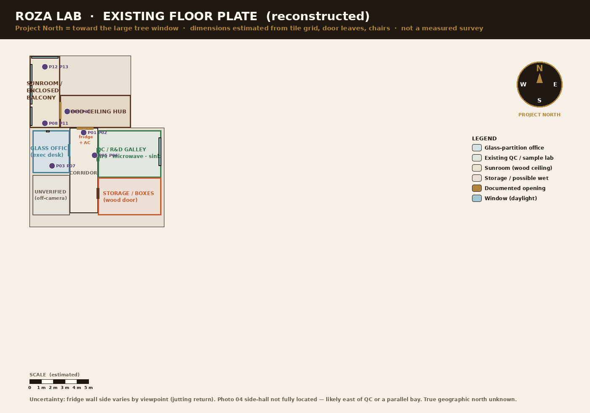

**Estimated overall plate:** about **11.5 m east–west × 14.5 m north–south** (~165 m²).

| Polygon | Est. size | Photo evidence |
|---|---|---|
| Enclosed balcony / sunroom | ~2.4 × 6.0 m | P08, P11 looking N; P12, P13 looking S |
| Wood-ceiling hub | ~6.0 × 2.8 m | P09, P10 foreground; wood slats + Crompton fan |
| Main corridor | ~2.2 × 7.0 m | P01, P02 |
| Glass private office | ~3.1 × 3.6 m | P03, P07 (visible in P01/P02) |
| QC / R&D galley | ~5.3 × 4.0 m | P05, P06 |
| South-east storage | ~5.3 × 3.2 m | Wood door in P02; boxes in P09/P10 |
| South-west bay | unknown | **Off-camera** — possible reception / entry |

---

## B. Photo survey of current conditions

Every source JPEG is in `photos/current/`. Directional overlays are in `photos/annotated/`. UUID originals are listed for traceability.

### Survey index

| ID | File | Standing | Looking | Connects to |
|---|---|---|---|---|
| P01 | `01_corridor_looking_project_north.jpg` | South of hub, open foyer | **PN** (tree window) | Hub, glass office W, corridor E |
| P02 | `02_corridor_hub_project_north.jpg` | Same hub, slightly east | **PN** | Same as P01; wood door E clearer |
| P03 | `03_glass_office_interior.jpg` | Glass-office doorway | Into the office | West glass room |
| P04 | `04_narrow_hall_brown_partition.jpg` | Secondary hall | Bright glass door | Side bay — **location uncertain** |
| P05 | `05_qc_rd_lab_from_corridor.jpg` | Corridor outside lab | Into QC galley | East lab |
| P06 | `06_qc_rd_lab_jars_and_sink.jpg` | Same as P05 | Into QC galley (wider) | East lab; **sink = wet point** |
| P07 | `07_glass_office_from_door.jpg` | Corridor at glass door | Same office as P03 | West glass room |
| P08 | `08_sunroom_looking_project_north.jpg` | South end of sunroom | **PN** along sunroom | North balcony |
| P09 | `09_wood_ceiling_hub_into_hallway.jpg` | Wood-ceiling hub | Through threshold into corridor | Hub ↔ spine |
| P10 | `10_wood_ceiling_hub_into_hallway_alt.jpg` | Same as P09 | Same | Hub ↔ spine |
| P11 | `11_sunroom_looking_project_north_alt.jpg` | South end of sunroom | **PN** | Same axis as P08 |
| P12 | `12_sunroom_looking_project_south.jpg` | North end of sunroom | **PS** (dead-end wall) | Reverse of P08/P11 |
| P13 | `13_sunroom_looking_south_with_doorway.jpg` | North-ish in sunroom | **PS**, doorway on east wall | Sunroom ↔ hub |

UUID map: P01 `e8acd304` · P02 `5f3dec56` · P03 `3f109f5a` · P04 `a59f8d44` · P05 `c6e56543` · P06 `7b745c99` · P07 `10a6ab4c` · P08 `dd4b80d3` · P09 `2d3e378c` · P10 `13d6bde0` · P11 `4ce4fd53` · P12 `e38c5f61` · P13 `16c13832`.

---

### P01 — Main corridor hub, looking Project North

**Standing:** open tiled foyer, south of the hub. **Looking:** Project North, down the corridor to the tree window. **West:** glass office with dark executive desk and backpack. **East:** dark door frame, then glass partitions. **Mid:** tall fridge and split AC on a jutting return. **Ahead:** daylight and trees — the Project North landmark. This is the **central circulation node**.


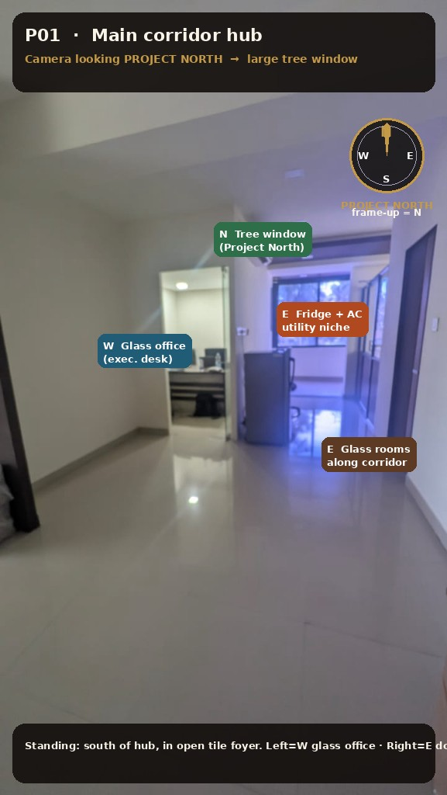

---

### P02 — Corridor hub, alternate angle (Project North)

**Standing:** same node, a step east. **Looking:** Project North. Confirms glass office **west**, dark wood door **east**, fridge + AC on the return, wood-toned ceiling toward the window. Best photo of **utility clutter in the spine** (the fridge should move).

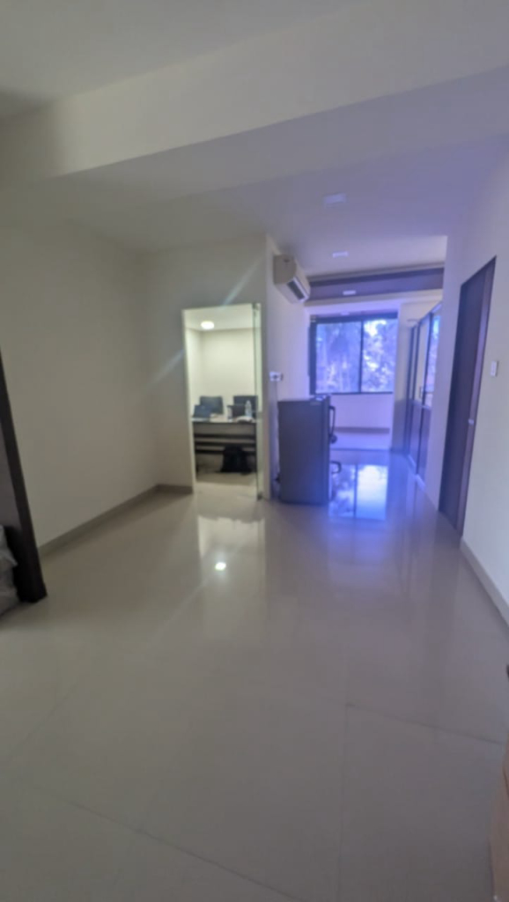

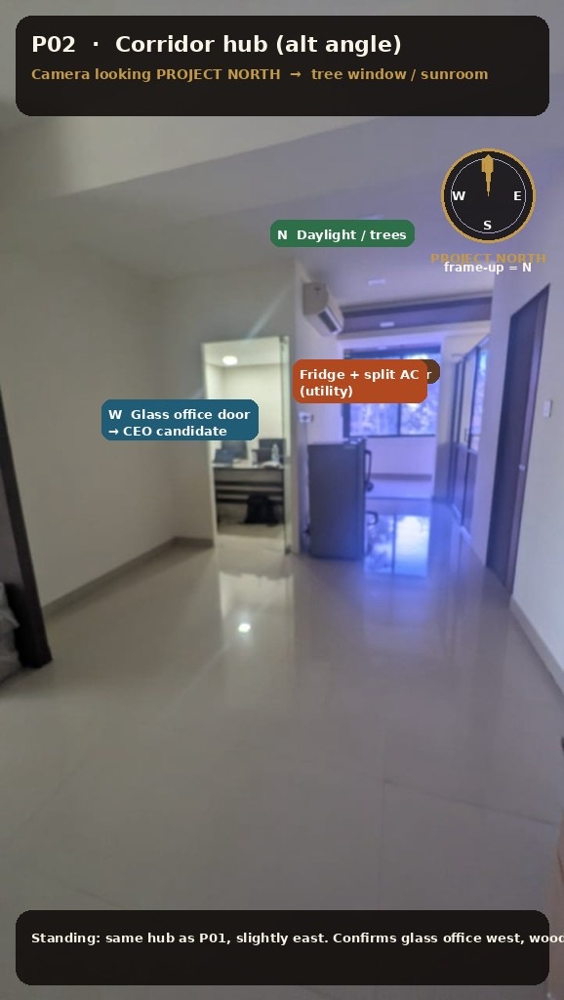

---

### P03 — Glass private office, interior

**Standing:** at the glass door. **Looking:** into the room; the occupant currently faces the corridor. Compact ~3 × 3.5 m. Dark wood slatted executive desk, three black mesh chairs, two laptops, water, tissue, a bag of coffee/grain sample, backpack under the desk. Narrow vertical exterior window with foliage. Desk-height power/data on the wall. **Proposed: CEO — Roshan Mahamood** (reuse the desk).


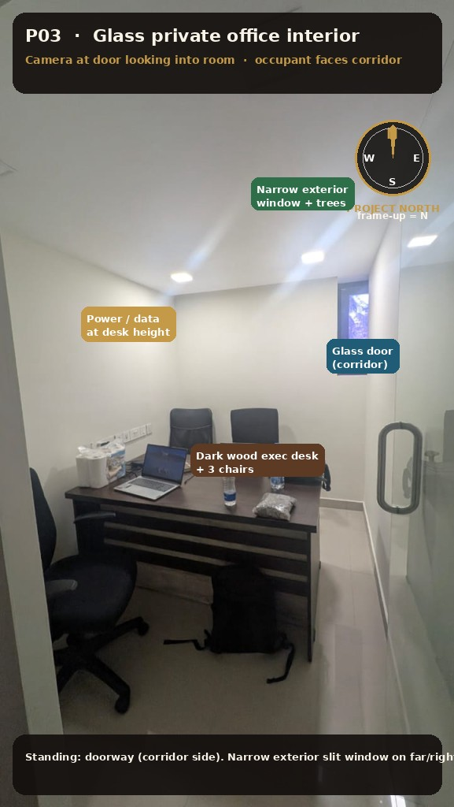

---

### P04 — Narrow secondary hall, brown partition

**Standing:** tight secondary circulation (~1.0–1.2 m wide by tile count). **Looking:** toward a bright glass door; striped screen beyond. **Left:** continuous white wall. **Right:** floor-to-ceiling dark wood partition; two wrapped packages on the floor. **Uncertain:** this bay is not unambiguously stitched to the main spine — likely east of QC or a parallel service hall. Do not demolish until it is located on a measured plan.


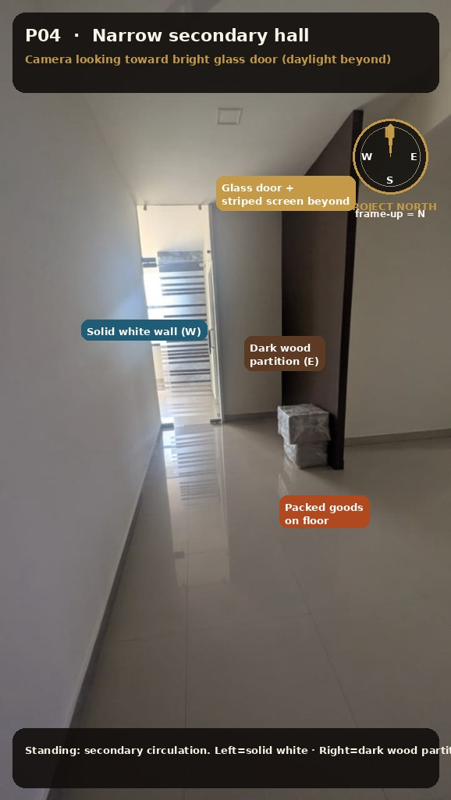

---

### P05 — QC / R&D galley from the corridor

**Standing:** in the corridor, looking through a **black-framed glass partition with dark wood slats on the lower third**. Hydraulic closer on the centre door. Inside: L-shaped wood counter, black task chair, microwave, long run of **red-lid glass jars**, window with vertical blinds, wood-recessed ceiling, ceiling fan. This is the existing **sample / nutrition / QC** room — **Sangeetha’s home**.


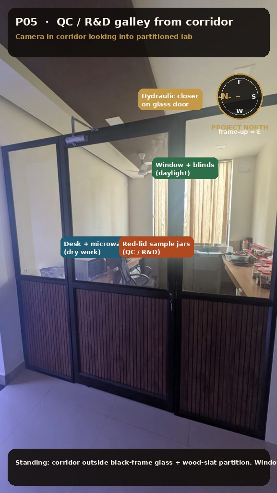

---

### P06 — Same lab, jars and sink (wet evidence)

**Standing:** same as P05, slightly wider. **Sink at the back-right** — the existing wet point. Kettle / appliances on the dry-desk side. **Do not lose this plumbing.** Keep Sangeetha’s dry desk; give cooking its own extract in the south-east bay so smell does not flood QC paperwork.

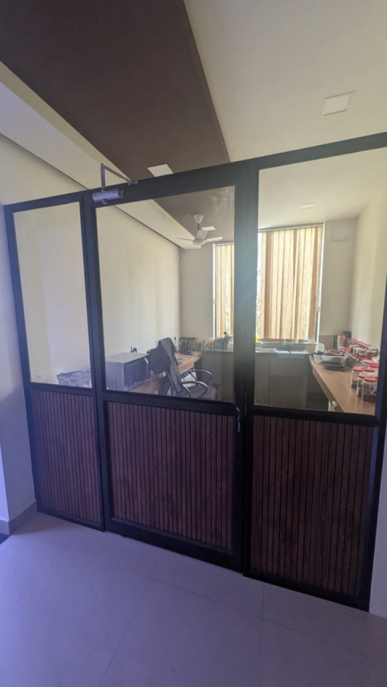

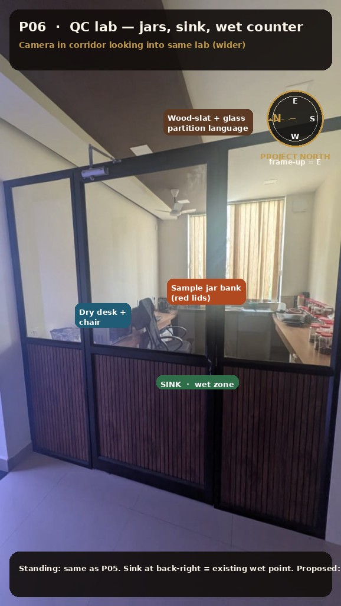

---

### P07 — Glass office from the doorway (same as P03)

**Standing:** corridor, D-handle glass door in the foreground. Same executive room. Confirms slit window, outlet strip, sample bag. Occupant faces entry — keep that for a CEO who wants visual control of the spine; add **frost film on the lower third** so screens and papers are not fully public.


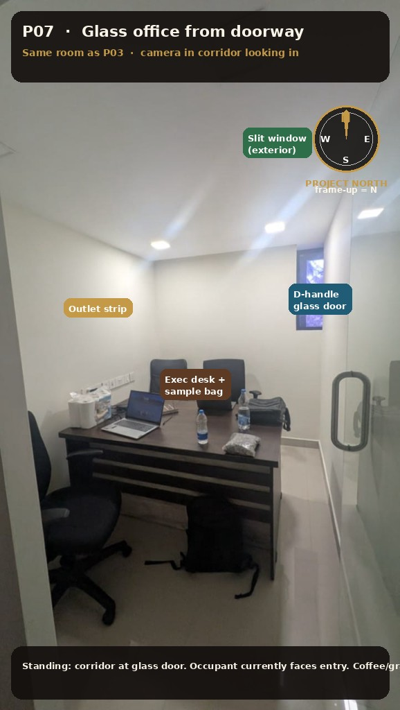

---

### P08 — Enclosed balcony / sunroom, looking Project North

**Standing:** south end of the long sunroom. **Looking:** Project North. **West + north:** black-framed windows onto trees. **East:** solid white wall, Crompton oscillating fan high. Dark wood-slat ceiling with square LED panels. One black task chair, otherwise empty. High daylight — **Nikhil / marketing / tasting**, not a kitchen.

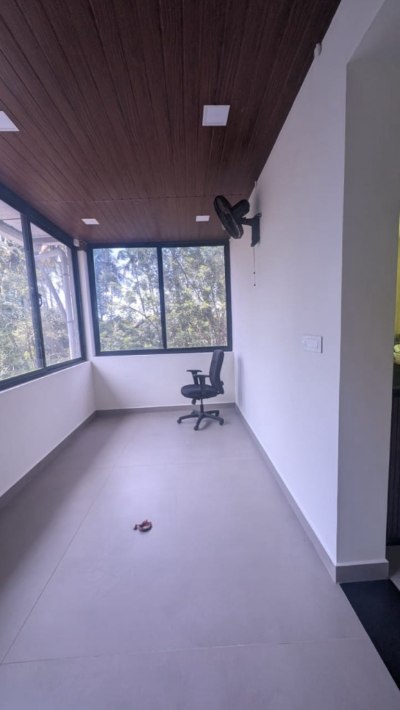

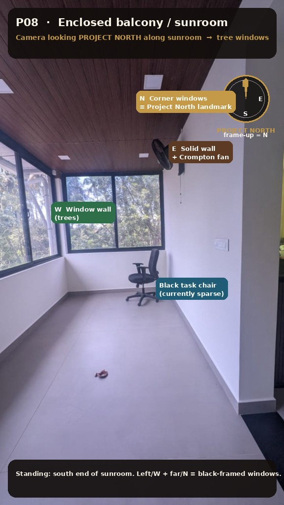

---

### P09 — Wood-ceiling hub looking into the hallway

**Standing:** in the prestige wood-ceiling room. **Looking:** through a wide, doorless opening with a **black stone threshold** into the corridor. Glass partition immediately inside; AC, chair, tall grey unit on the other side; boxes in the distance. **This hub is the proposed central monitoring wall** — every journey crosses it.


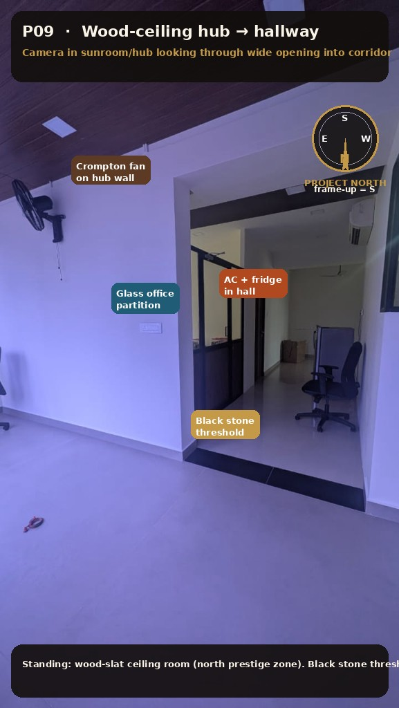

---

### P10 — Hub → hallway, alternate frame

**Standing:** same hub. Confirms switches on the left wall, glass + dark base partition, split AC, fridge, cardboard beyond. Ceiling changes from **wood slats (hub)** to **white (corridor)** — keep that material shift; hang the TV wall on the hub side where the wood already signals brand.


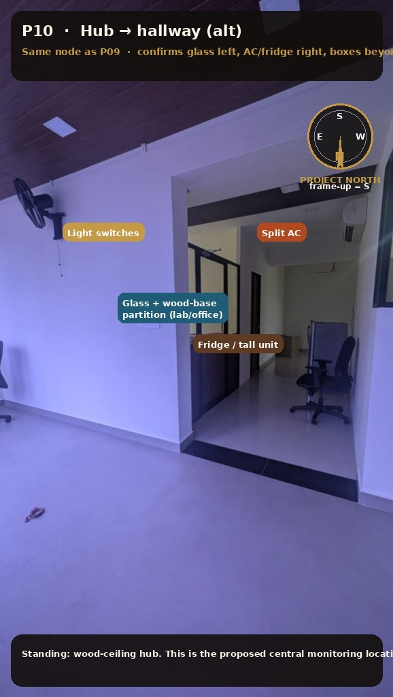

---

### P11 — Sunroom looking Project North (alternate)

Same N–S sunroom as P08. Linear, ~2.2 m wide. Dead-end at the far window corner. **Do not put extract hoods here** (windows, no obvious soil stack, brand-facing). Use for Nikhil’s desk facing the trees plus a small tasting table near the hub opening.


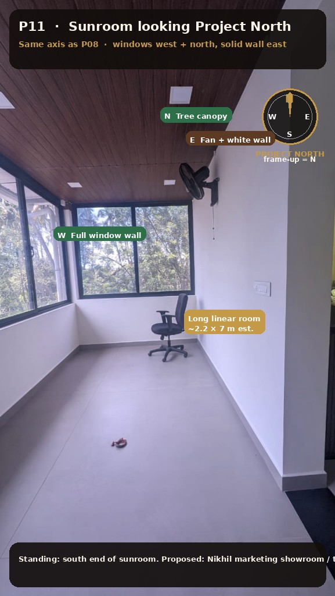

---

### P12 — Sunroom looking Project South (reverse)

**Standing:** at the tree-window end. **Looking:** Project South. Windows now on the **right (west)** — the reverse of P08/P11, which **proves the sunroom is a north–south bar**. Interior wall + opening on the east. Far wall is a dead end (not an exit).


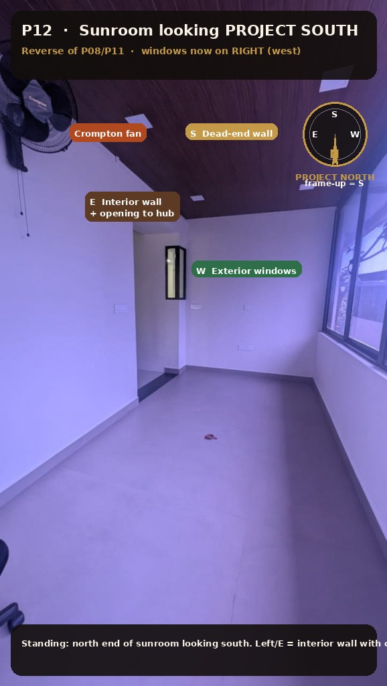

---

### P13 — Sunroom south view with hub doorway

**Standing:** further into the sunroom looking Project South. **East wall:** wide opening with the **same black threshold** as P09/P10 — this is how the sunroom joins the hub. **West:** window wall on a knee wall. Linear dead-end. Electrical plates on the south wall.


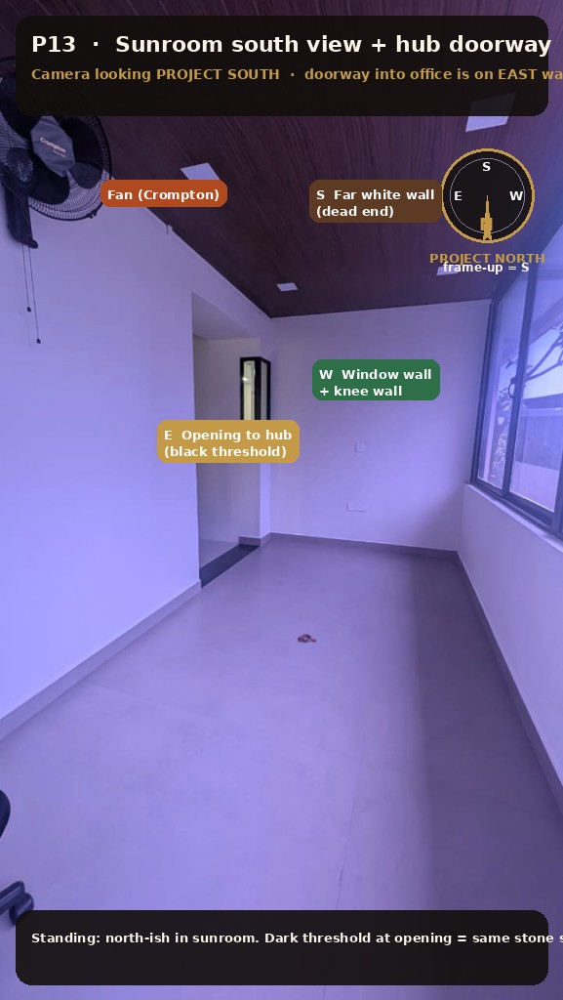

---

## D. Proposed complete interior

### Zoning and adjacency

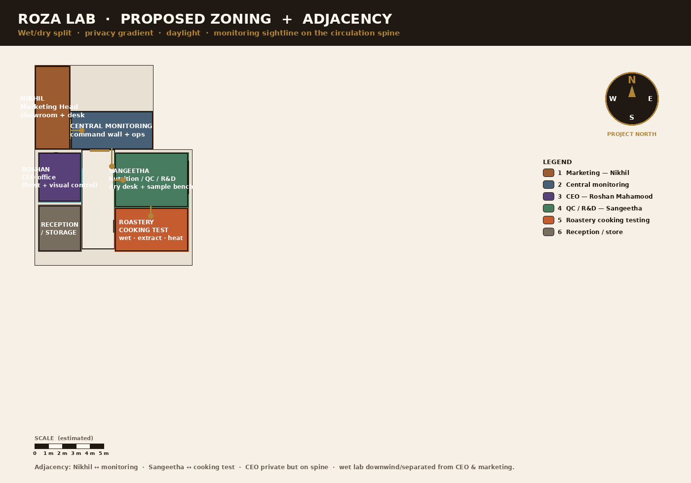

| Zone | Occupant / use | Why this polygon |
|---|---|---|
| **1. Sunroom** | **Nikhil** — marketing desk + tasting lounge | Highest daylight, wood ceiling already on-brand, adjacent to the hub/monitoring. Not a wet lab. |
| **2. Wood-ceiling hub** | **Central monitoring** + ops desk | The only node every occupant crosses. Sightline down the corridor. Not inside the CEO office. |
| **3. West glass office** | **Roshan Mahamood** — CEO | Existing executive desk, door onto the spine, slit window, meeting side with two visitor chairs. Frost lower glass; keep upper glass for visual control. |
| **4. East galley** | **Sangeetha** — nutrition / QC / R&D | Existing jars, microwave, dry desk, daylight. Hygiene-capable work without cooking heat. |
| **5. South-east bay** | **Roastery cooking testing** | Wet, extract, heat. Reuses the wood door and the existing sink adjacency. Smell/heat stay off the marketing/CEO side. |
| **6. South-west bay** | Reception / store *(if the unverified bay exists)* | Entry buffer so visitors do not walk straight into QC. |

**Adjacency rules satisfied**

- Wet lab **away from CEO**.
- Sangeetha **adjacent** to cooking test (door or pass-through between galley and wet bay).
- Nikhil **adjacent** to monitoring (sunroom opening into the hub).
- CEO **private** with **some visual control** of the spine.

### Furniture layout

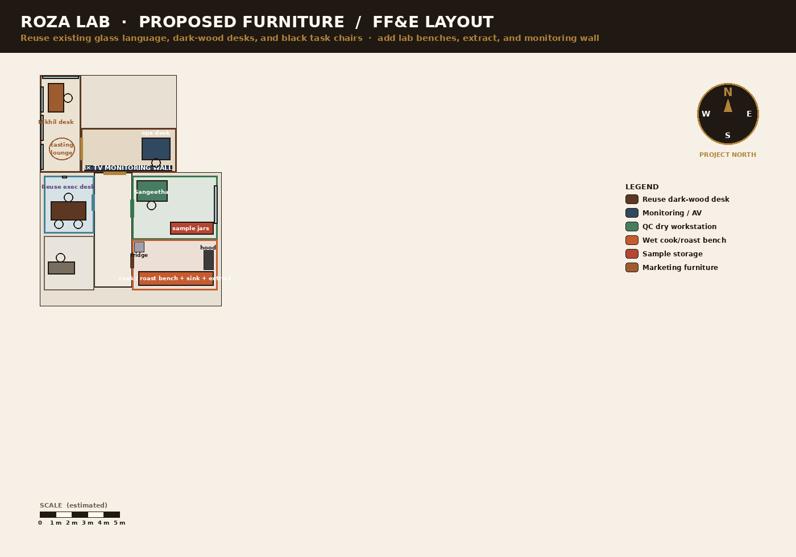

| Room | Keep | Add |
|---|---|---|
| CEO | Dark-wood slatted desk, 3 black mesh chairs | Frost film, door closer, 1 lockable credenza, desk lamp |
| Monitoring hub | Wood ceiling, threshold | 6-panel TV wall, ops console, cable tray, UPS |
| Nikhil / sunroom | Crompton fan, window wall | 1400 mm desk facing west glass, tasting table Ø900, pinboard, blackout on north if needed for screens |
| Sangeetha | Jar run, dry desk, chair, microwave (relocate off wet) | Task lights 500 lux, under-counter sample fridge, wipe-clean bench |
| Cooking test | Existing sink (extend waste if needed) | 2400 mm heat bench, induction + sample roaster, stainless extract hood, splashback, fire blanket |
| Spine | Split AC | **Remove fridge from corridor**; pantry housing in the wet/storage bay |

### Central monitoring / command wall

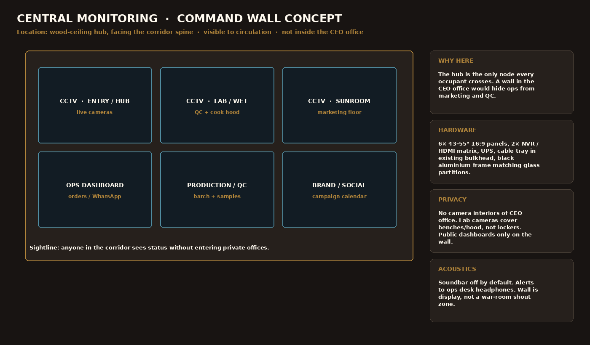

Six 43–55″ panels in a 3×2 grid on the **hub wall that faces the corridor**:

| Panel | Content |
|---|---|
| CCTV — entry / hub | Live cameras on the spine and threshold |
| CCTV — lab / wet | QC benches and cook hood (not lockers) |
| CCTV — sunroom | Marketing floor occupancy |
| Ops dashboard | Orders / WhatsApp queue (HUBB storefront ops) |
| Production / QC | Batch and sample status |
| Brand / social | Campaign calendar |

**Privacy.** No cameras inside the CEO office. Lab cameras cover benches and the hood only. The wall shows **public** dashboards — not HR or payroll. Soundbar off by default; alerts to ops headphones.

### Circulation, daylight, privacy

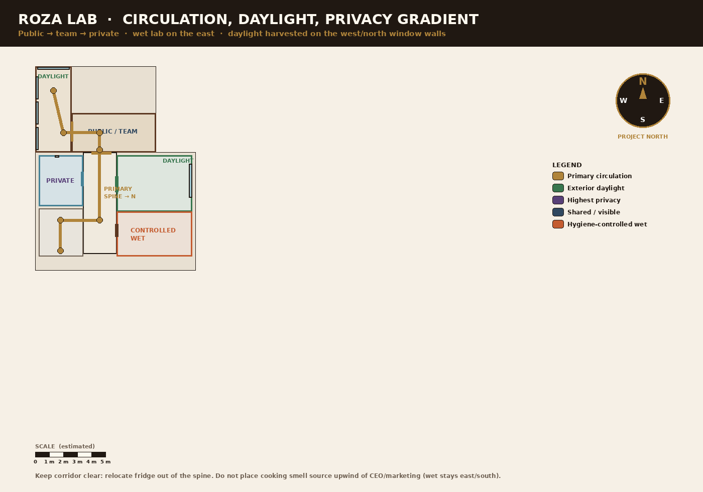

Primary path: reception (S) → corridor spine → hub → sunroom (N). Glass language stays. Wet stays **east**. Daylight stays **west/north**.

### Materials / palette

Match what is already there, then add roastery warmth only where the wood ceiling already exists.

| Element | Existing | Proposed |
|---|---|---|
| Walls | Off-white / cream | Keep; wipe-grade paint in wet bay |
| Floor | Large light tiles, high gloss in corridor, matte in sunroom | Keep; add drainable tile or sheet in wet bay if hood is installed |
| Glass | Black / dark metal frames, wood slats on lower third of lab | Keep; frost film on CEO lower glass |
| Wood | Espresso desk, slat ceiling, brown partitions | Keep; new benches in the same tone or stainless in wet |
| Metal | Black frames, silver fridge, Crompton fan | Black AV frame to match partitions |
| Brand | Coffee / HUBB warmth | Restrict saturated roast-orange to signage and the monitoring bezel, not whole walls |

Lighting, HVAC, electrical, and camera schedules are in [specs.md](specs.md).

---

## E. Visualizations

### Measured-estimate drawings (from photo polygons)


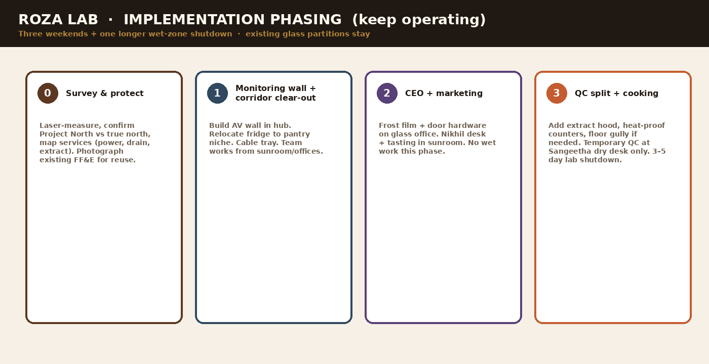

### Generated concept views (illustrative — not photographs of the finished room)

These are AI concept images used to communicate atmosphere. **The polygonal drawings above govern construction.** Labels in generated images may be imperfect.

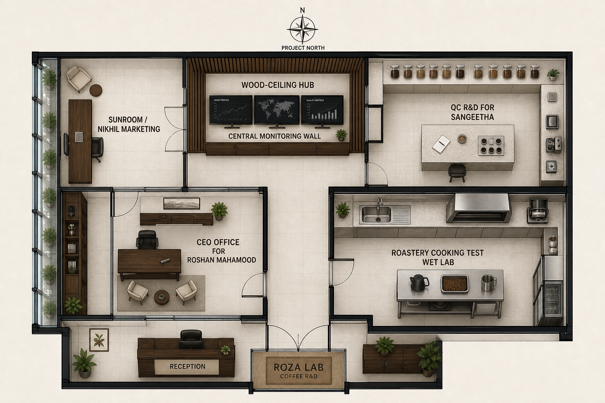

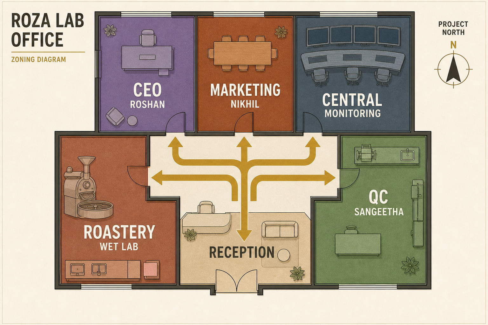

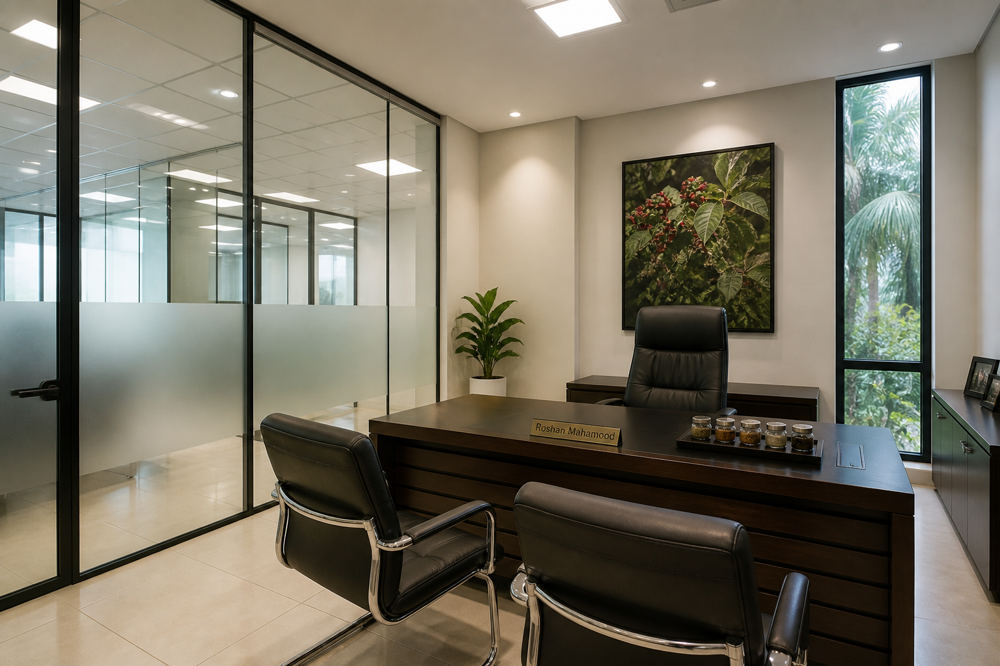

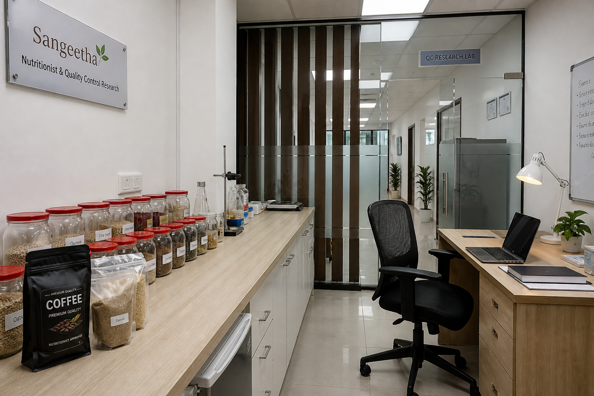

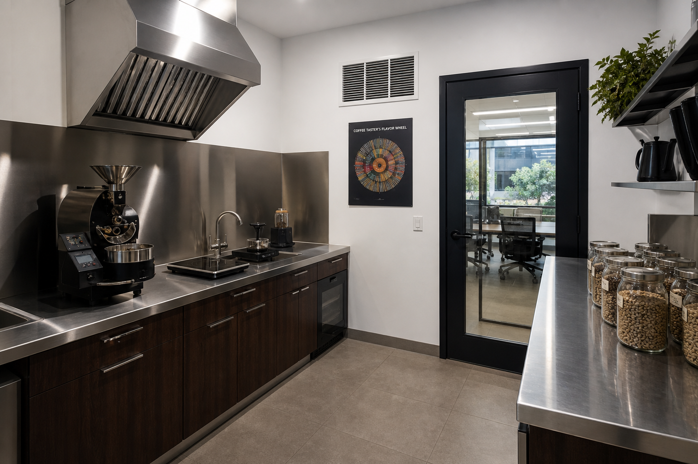

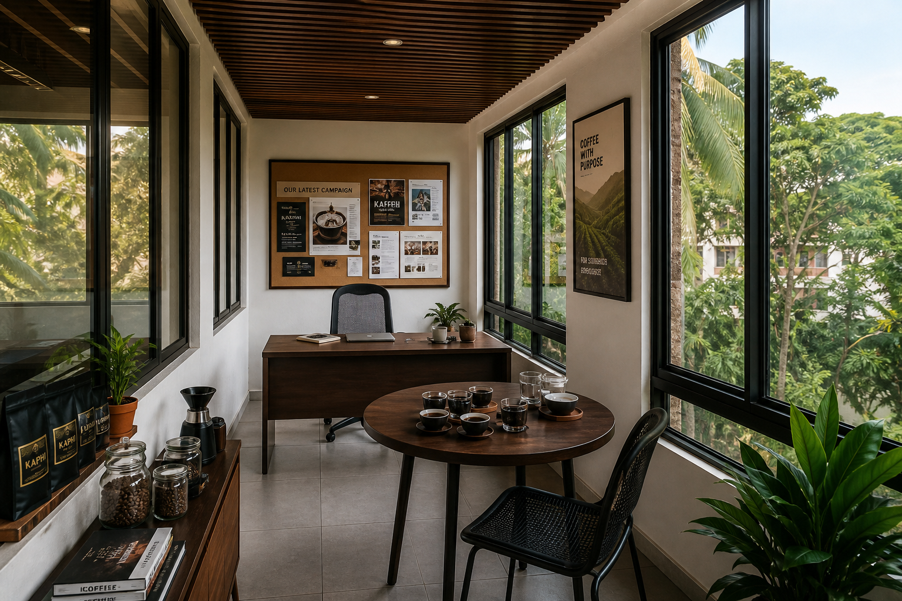

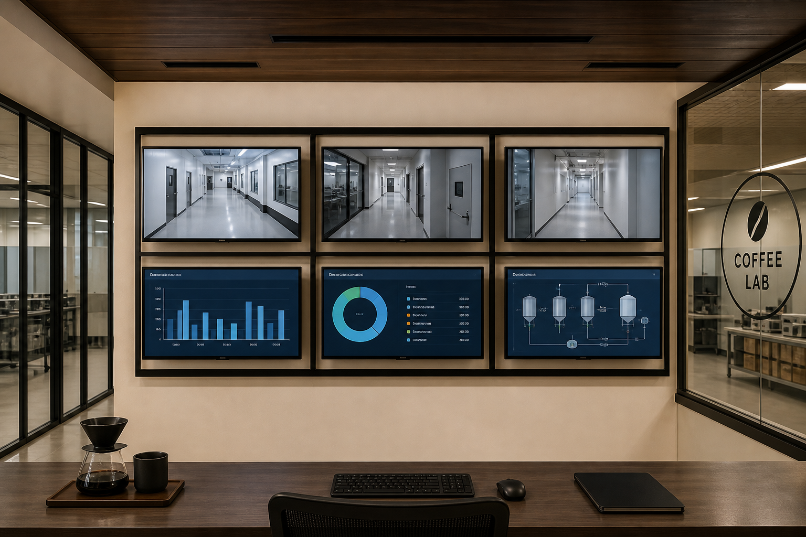

---

## Implementation phasing


The lab can keep operating if work is sequenced:

| Phase | Work | Occupancy |
|---|---|---|
| **0 — Survey** | Laser-measure, confirm Project North vs true north, map power / drain / extract. Photograph FF&E for reuse. | Full |
| **1 — Monitoring + corridor** | AV wall in the hub. Relocate fridge. Cable tray. | Team uses sunroom and offices |
| **2 — CEO + marketing** | Frost film, Nikhil desk, tasting table. No wet work. | QC stays live |
| **3 — QC split + cooking** | Extract hood, heat bench, splashback. | **3–5 day lab shutdown**; Sangeetha dry-desk only if needed |

Existing glass partitions stay. Do not rip out the wood-slat language — it is the brand.

---

## Uncertainties — what to verify on site

1. **True north** vs Project North (phone compass on the tree-window wall).
2. **Fridge wall** — photos disagree slightly because it sits on a **jutting return**; confirm which face is east.
3. **Photo P04** side hall — not fully located on the plate.
4. **South-west bay** — never photographed; reception is a **hypothesis**.
5. **Drain and extract** capacity for a sample roaster (building rules, grease, make-up air).
6. **Tile module** assumed 600×600 mm; measure one grout-to-grout.
7. **Structural** capacity of the hub wall for six TVs + tray.
8. **Entry sequence** from the building lobby — not in this photo set.

Until those are measured, treat all metre labels as **±20%**.

---

## How to regenerate drawings

```bash
python3 docs/roza-lab/scripts/annotate_photos.py
python3 docs/roza-lab/scripts/draw_plans.py
```

Requires Python 3 and Pillow (`pip install pillow`).
