# Roza Lab — Interior Design Documentation Package

> **Design basis:** 13 owner-supplied mobile photos; no dimensional survey, reflected ceiling plan, utility survey, or confirmed geographic north was supplied. This package is an evidence-led schematic design, not a permit, construction, fire, food-safety, or MEP drawing.

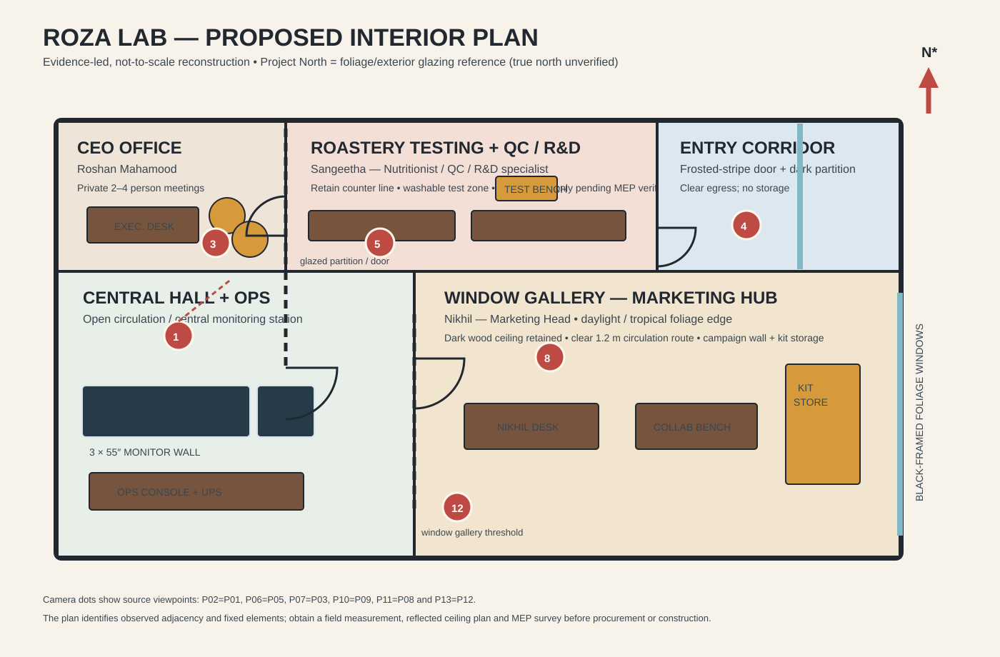

## Design decision at a glance

The photos support a compact suite rather than a blank warehouse: an open central hall, a small glazed office, a glass-fronted counter room, an entry-side narrow corridor, and one long daylight gallery with a dark wood ceiling and black-framed foliage windows. The design keeps those assets in place.

- **Roshan Mahamood — CEO:** the compact glazed room (P03/P07) becomes a private executive office with a 1.2 m frosted-film privacy band, acoustic panels, executive desk and a two-to-four person meeting setting.
- **Sangeetha — Nutritionist / QC / R&D:** the existing glass-fronted counter room (P05/P06) becomes the combined QC desk and controlled small-batch research room. The counter with jars/microwave becomes the roastery cooking-testing line after safety upgrades.
- **Nikhil — Marketing Head:** the long foliage-window gallery (P08–P13) becomes the marketing hub: campaign desk, collaboration bench, kit storage and a brand/pin-up wall without blocking its linear circulation.
- **Central monitoring:** the open hall (P01/P02) receives a shallow, lockable three-screen operations console. It is deliberately **outside** the CEO office; its cameras cover common routes and equipment entry only.

## Evidence, direction and confidence

### Direction convention

The site photos contain no reliable geolocation, compass metadata, site plan, or sun study. It would be inaccurate to label one wall as real-world north. All plates therefore show:

- **Project North (N\*)** = the foliage/exterior-glazing reference used consistently on the diagrams.
- **Camera-facing direction** = the observed subject of each image.
- **Left / ahead / right** = relative to the camera, not a claimed cardinal bearing.

The red arrow on each plate points from the camera position into its observed view. The diagram’s numbered red dots reconcile the non-duplicate source viewpoints. Exact room lengths, door swings and external façade orientation must be field-verified.

### Reconstruction method

I researched three public GitHub projects through GitHub search before drawing this package:

| Reference | Why it was selected | Method applied here | Why it was not run as a detector |
|---|---|---|---|
| [ywyue/RoomFormer](https://github.com/ywyue/RoomFormer) — CVPR 2023, ~333 stars | Reconstructs room polygons and can extend to doors, windows and room semantics. | Treat rooms, openings and exterior glazing as separate evidence layers; reconcile the whole suite instead of assuming isolated rectangles. | Its published pipeline expects density maps / 3D scan data. Thirteen uncalibrated phone photos cannot provide its required geometry honestly. |
| [sunset1995/HorizonNet](https://github.com/sunset1995/HorizonNet) — CVPR 2019, ~370 stars | Strong reference for Manhattan alignment, vanishing points and room layout from imagery. | Read persistent ceiling lines, tile lines, black frames, door planes and window planes before assigning viewpoint labels. | It is designed for 360° panoramas, not the supplied partial perspective views. |
| [art-programmer/FloorplanTransformation](https://github.com/art-programmer/FloorplanTransformation) — ~678 stars | A mature raster-to-vector plan reference that separates plan grammar into meaningful architectural elements. | Deliver a legible vector plan with walls, glazing, doors, furniture, zones and camera markers instead of a decorative sketch. | It transforms existing raster floor plans; no surveyed floor plan was supplied to vectorize. |

The manual pipeline follows the useful part of those methods: (1) group overlapping views and retain supplied duplicates, (2) inventory fixed planes/openings/MEP, (3) establish an adjacency graph, (4) assign uses that respect the observed footprint, and (5) mark uncertainty instead of fabricating meters.

### Reconstructed relationship diagram

```text
                     N* = exterior foliage / glazing reference (not true north)
┌─────────────────────────┬─────────────────────────────┬──────────────────────┐
│ Compact glass office    │ Glass-fronted lab / counter  │ Narrow entry corridor│
│ P03, P07                │ P05, P06                     │ P04 striped-glass door│
│ → CEO: Roshan           │ → Sangeetha + test line      │ → protected egress    │
├─────────────────────────┴───────┬───────────────────────┴──────────────────────┤
│ Open central hall P01, P02      │ Long wood-ceiling window gallery P08–P13     │
│ → circulation + TV monitoring  │ → Nikhil / marketing hub                     │
└─────────────────────────────────┴──────────────────────────────────────────────┘
```

**Confidence:** the compact office, lab/counter room, hall, entry passage and window gallery are high-confidence observed spaces. The exact exterior perimeter, scale and the precise location of any sink/drain are unknown. The plan is intentionally schematic and must not be scaled for construction.

## Current-conditions photo index

| ID | Observed viewpoint / direction | Space and current-condition evidence |
|---|---|---|
| P01 | From south end of hall, facing AC / fridge / daylight glazing | Open tile hall; small office entry at left; air conditioner and glazing/corridor edge. |
| P02 | Same as P01 | Supplied duplicate retained. |
| P03 | At compact-office door, facing high window | Narrow glass-partition office; desk, chairs, low ceiling and recessed lights. |
| P04 | Inner narrow passage, facing striped-glass door | Egress-like corridor with solid wall left and tall dark-brown divider right. |
| P05 | Outside lab door, facing counters | Black-framed glass partition; wood-slat lower panels; desk counter, jars, microwave, blinds. |
| P06 | Same as P05 | Supplied duplicate retained. |
| P07 | Same as P03 | Supplied duplicate retained. |
| P08 | Gallery connection, facing foliage windows | Long narrow daylight room; dark wood ceiling, tiles, black frames, fan. |
| P09 | Gallery near windows, facing hall | Black threshold to hall; glazed lab/wood-slat frontage at left. |
| P10 | Same as P09 | Supplied duplicate retained. |
| P11 | Same as P08 | Supplied duplicate retained. |
| P12 | Gallery window end, facing back along room | Linear room with window wall at right, fan and return opening. |
| P13 | Same as P12 | Supplied duplicate retained. |

## Current conditions: source + directional survey plates

Every original supplied photo is preserved below; the matching plate is a copy with directions physically overlaid on the image.

<details open>
<summary><strong>P01 — Central hall / monitoring approach</strong></summary>
<p>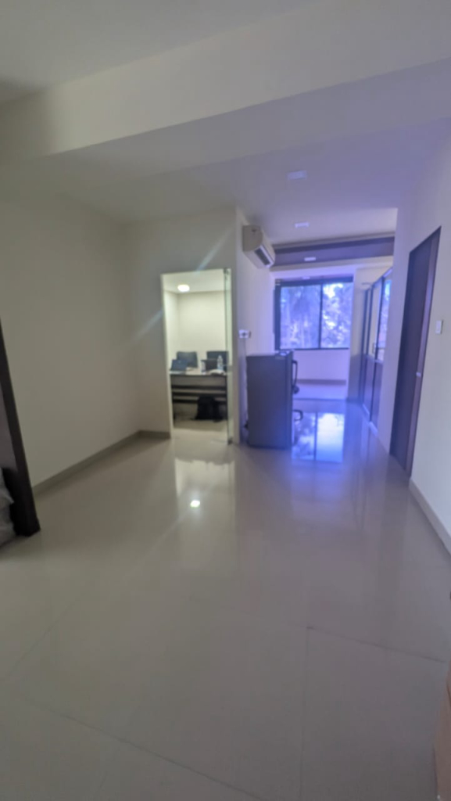 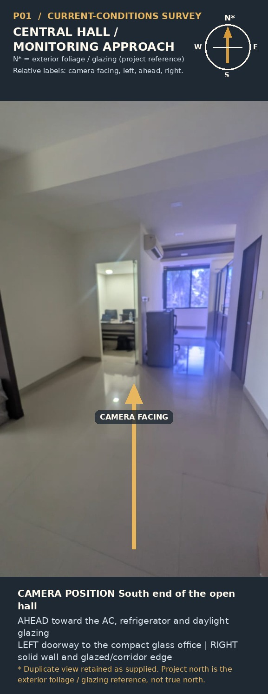</p>
<p>Open hall, glossy pale tile, white walls, split AC, small glass-office door left and daylight at the end. Preserve circulation for the proposed monitoring console.</p>
</details>

<details>
<summary><strong>P02 — Central hall / monitoring approach (supplied duplicate)</strong></summary>
<p> </p>
<p>Same viewpoint as P01 retained for traceability.</p>
</details>

<details>
<summary><strong>P03 — Compact glass office</strong></summary>
<p>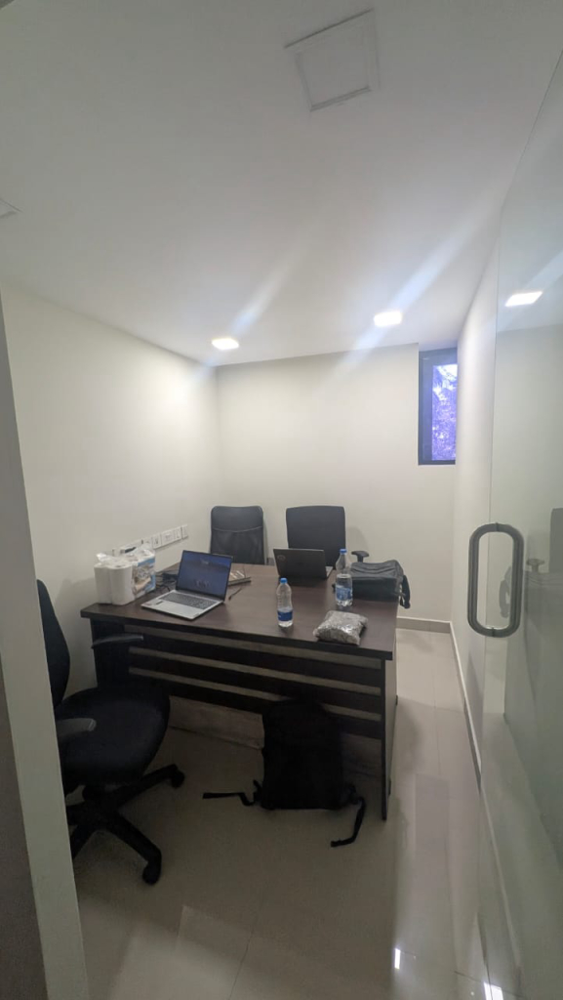 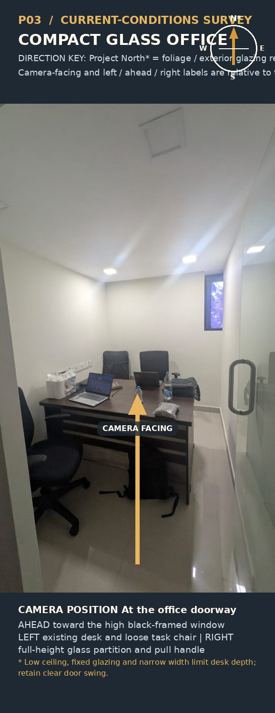</p>
<p>Existing desk/chairs, full-height glass, pull handle, small high window and low white ceiling constrain the private-office fit-out.</p>
</details>

<details>
<summary><strong>P04 — Entry-side narrow corridor</strong></summary>
<p> 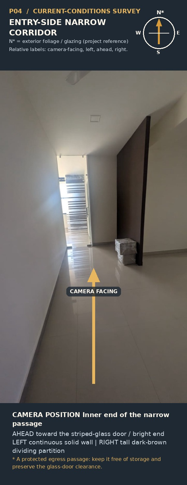</p>
<p>Striped-glass door and narrow passage require a clear, storage-free exit path.</p>
</details>

<details>
<summary><strong>P05 — Glass-fronted lab / workroom</strong></summary>
<p> 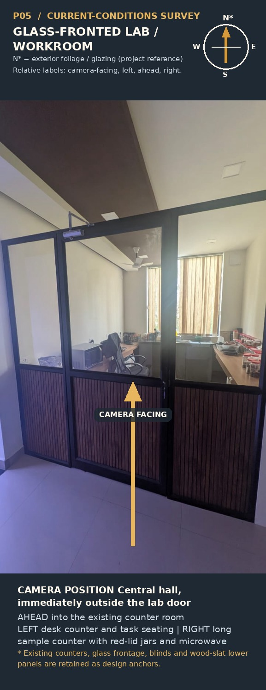</p>
<p>Observed counter line, microwave and red-lid jars (described in the brief as sample jars) indicate a small existing test/work area.</p>
</details>

<details>
<summary><strong>P06 — Glass-fronted lab / workroom (supplied duplicate)</strong></summary>
<p> 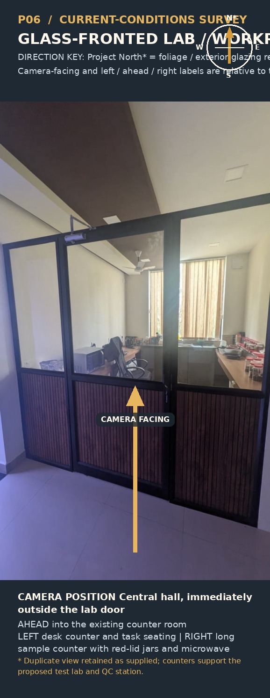</p>
<p>Same lab view retained to account for all supplied images.</p>
</details>

<details>
<summary><strong>P07 — Compact glass office (supplied duplicate)</strong></summary>
<p> 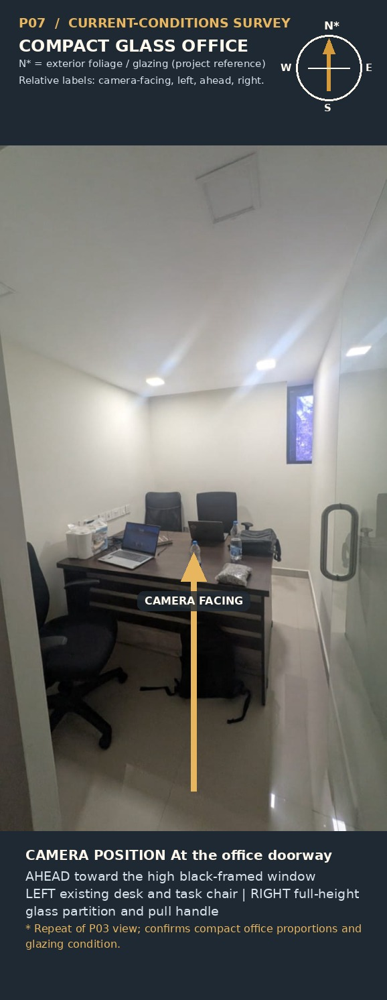</p>
<p>Confirms the compact office glazing and task-setting proportions.</p>
</details>

<details>
<summary><strong>P08 — Long window gallery</strong></summary>
<p> 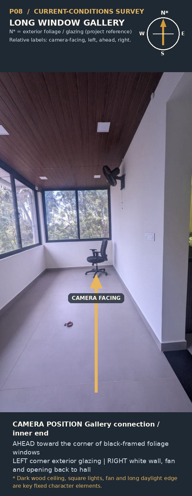</p>
<p>The dark wood ceiling, square downlights, fan and foliage glazing are retained as the marketing hub’s character.</p>
</details>

<details>
<summary><strong>P09 — Window gallery looking to central hall</strong></summary>
<p> 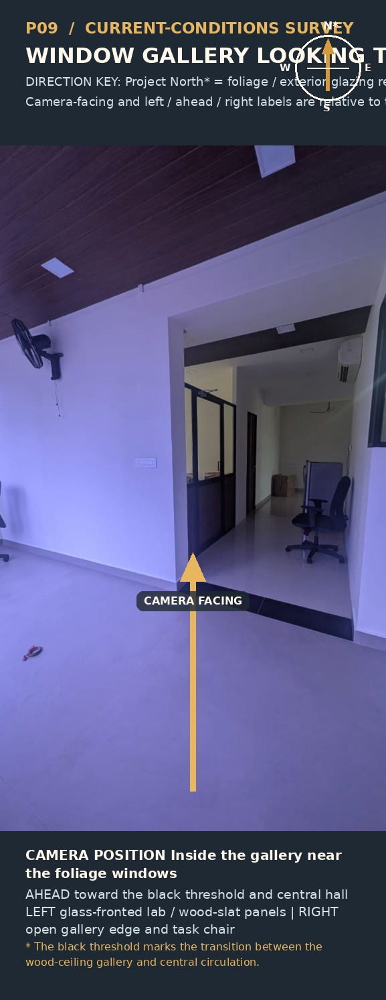</p>
<p>Shows gallery-to-hall threshold and lab glass frontage; supports the proposed adjacency model.</p>
</details>

<details>
<summary><strong>P10 — Window gallery looking to central hall (supplied duplicate)</strong></summary>
<p>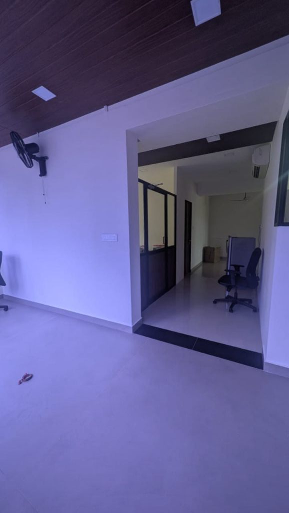 </p>
<p>Same hall-facing gallery view retained for traceability.</p>
</details>

<details>
<summary><strong>P11 — Long window gallery (supplied duplicate)</strong></summary>
<p> 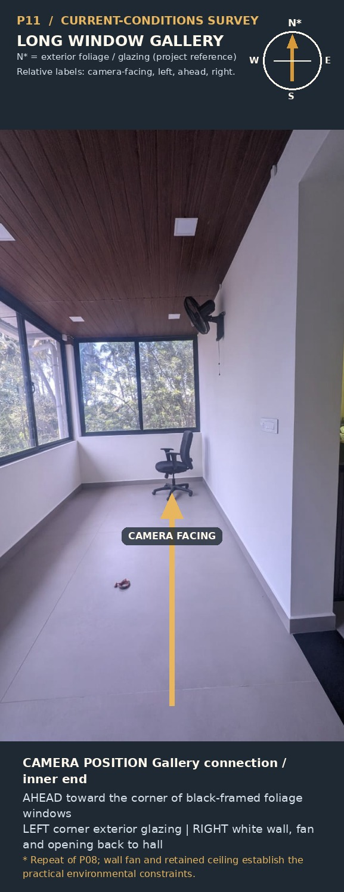</p>
<p>Confirms the linear gallery dimensions and wall-fan condition.</p>
</details>

<details>
<summary><strong>P12 — Long window gallery, reverse view</strong></summary>
<p> 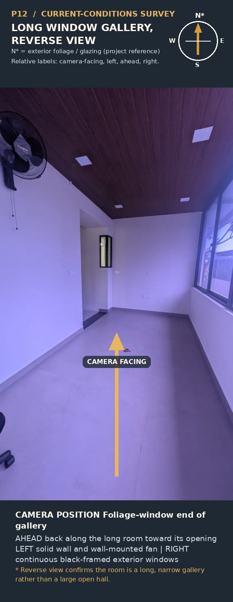</p>
<p>Reverse view confirms this is a narrow, long room with continuous exterior window edge, not an open warehouse.</p>
</details>

<details>
<summary><strong>P13 — Long window gallery, reverse view (supplied duplicate)</strong></summary>
<p> 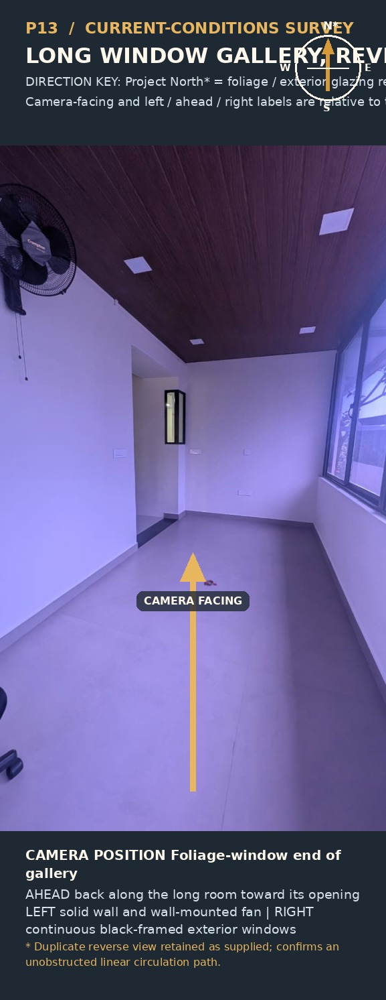</p>
<p>Same reverse view retained for full supplied-photo coverage.</p>
</details>

## Proposed layout and operational program

### 1. CEO office — Roshan Mahamood

Use the observed compact glass office without moving walls.

- **Privacy:** apply a continuous **1.2 m high frosted film band** to the existing glass, leaving daylight above; add a lined acoustic curtain or removable fabric panel inside the glazing only if speech privacy testing requires it. Use a solid-core door seal/drop seal if the existing door permits it.
- **Furniture:** 1400–1600 mm x 700–750 mm executive desk along the solid wall, compact credenza/lockable file unit, ergonomic chair and two guest chairs. A small round table can create a four-person meeting only after a measured clearance check.
- **Acoustics:** two or three 25 mm fabric-wrapped absorption panels on solid walls; carpet tile/rug under the guest setting with a non-slip underlay. Do not block the high window, AC path or glass-door swing.
- **Lighting:** retain existing downlights; add a dimmable 3000–3500 K desk task light. No CCTV camera inside.

### 2. Marketing Head — Nikhil

Assign the long wood-ceiling gallery to marketing because it has the best daylight, longest continuous wall and direct connection to the central hall.

- **Work setting:** Nikhil’s 1600 mm campaign desk sits inward of the window line, perpendicular to windows to minimize screen glare. A 1400–1600 mm collaboration bench seats two and can be cleared for product shoots.
- **Brand and kit storage:** one lockable 400–450 mm-deep tall cabinet at the opaque end; a shallow, rail-mounted campaign/pin-up wall on the long solid wall. Avoid a deep cabinet on the exit route.
- **Circulation:** preserve a continuous **minimum 1200 mm target clear path** from the black threshold to the window end. Confirm statutory local egress clearance before construction.
- **Comfort:** retain the wood ceiling, black frames and wall fan; use window shades that preserve foliage views and reduce afternoon glare.

### 3. Nutritionist / QC / R&D — Sangeetha

Locate Sangeetha’s specialist station within the observed glass-fronted counter room, directly adjacent to the testing line.

- **QC desk:** height-adjustable 1200–1400 mm desk with laptop dock, high-CRI (90+) 4000 K inspection lamp, neutral removable sample mat, digital scale zone and labelled sample trays.
- **Review/storage:** shallow lockable sample drawer or undercounter refrigerator (only after confirming heat rejection, circuit capacity and food-safety requirement); clear allergen/sample segregation and a small two-person review perch.
- **Separation:** use transparent/opaque labelled bins and a washable splashback to distinguish paperwork/QC from hot testing. Do not use the existing wooden counter as an unprotected heat surface.

### 4. Dedicated roastery cooking-testing research line

The right-hand existing lab counter shown in P05/P06 is the dedicated compact test line. This preserves the real room and reduces disruptive construction.

- Retain sound counters where feasible; over the hot appliance zone add a **stainless-steel or sintered-stone heat-resistant work surface**, coved easy-clean splashback and mobile heat-resistant landing surface.
- Use **electric** bench equipment only until a licensed mechanical/fire review confirms equipment, extraction, electrical load and local food-production rules. Do not introduce gas from this photo-only survey.
- Place microwave/oven/compact sample roaster on dedicated, labelled circuits with manufacturer clearances; no appliance under a non-rated timber surface.
- Provide lidded red-lid jar storage in a cool, dry enclosed bay; use food-safe labels, date/lot control, allergen cleaning procedure and a separate waste container.
- Put a suitable extinguisher and fire blanket at the door-side approach, not above the heat source. Keep a clear exit to the glazed door.
- **Sink:** add only if a site visit proves an existing water/waste route and food-process requirements. The photos do **not** prove plumbing.

### 5. Central TV monitoring station

The central hall receives the monitoring station so the operator can see the common space and respond without occupying a private office.

- Mount **three 55 in commercial displays** on a solid wall at comfortable seated eye height, with a shallow 600 mm-deep console, low-glare screen angle and cable raceway behind a lockable low cabinet.
- Put NVR, network switch and UPS in a ventilated, lockable cabinet; label circuits and leave service access. Use a dedicated data run and surge-protected power.
- Feed operations dashboard, entry/common-area cameras, lab-entry/equipment view and gallery circulation view. Do not point cameras at employee screens, inside the CEO office, wash/changing areas, or where local privacy rules prohibit coverage.

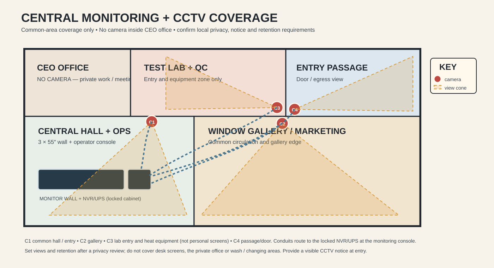

## Proposed design visualizations

These are AI-generated concept visualizations constrained by the supplied photos. They show material, furniture and atmosphere intent—not exact dimensions, product specifications or construction conditions. The vector plan above is the authoritative spatial proposal.

| View | Visualization | Design intent |
|---|---|---|
| Roshan’s CEO office | 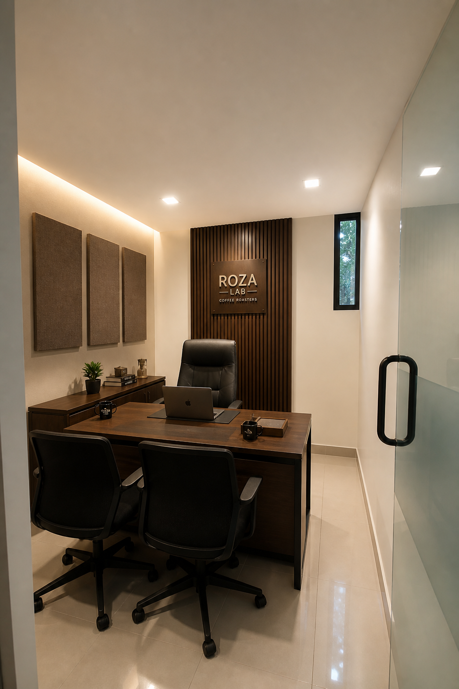 | Preserve compact glazed footprint; add privacy film, acoustic finish and short meetings. |
| Nikhil’s marketing hub | 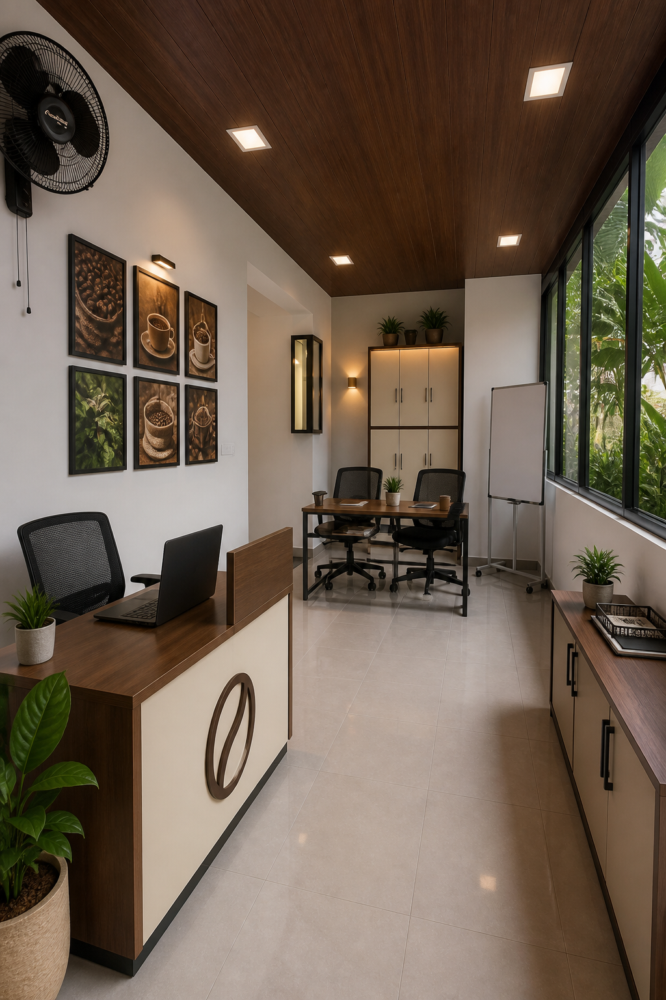 | Retain dark wood ceiling, foliage windows and long circulation route. |
| Sangeetha’s QC / R&D station | 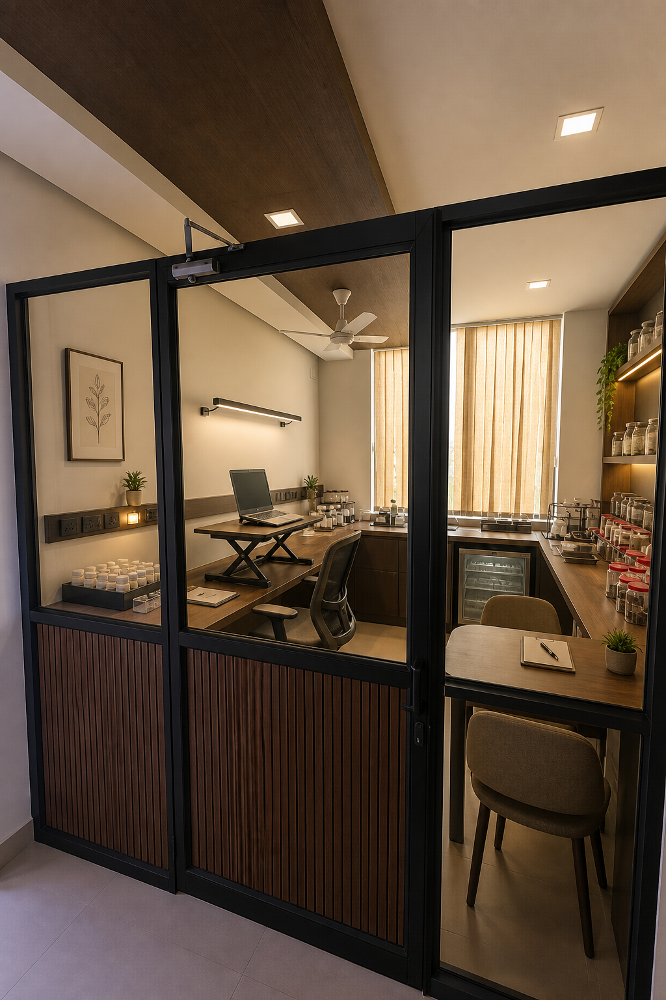 | Organize sample review and high-CRI task work next to lab counter. |
| Roastery test lab | 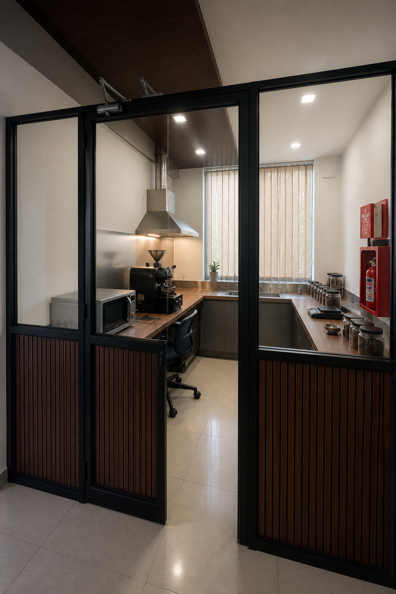 | Make existing counter room safe for small-batch electric testing. |
| Central monitoring station | 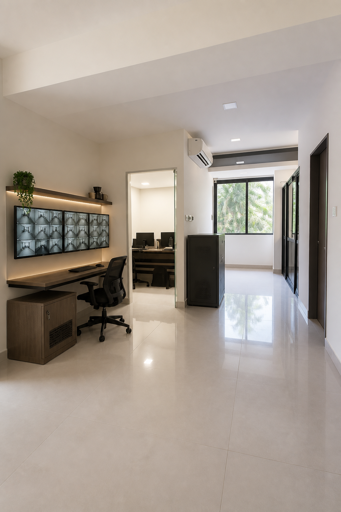 | Use open hall wall; keep the office-private setting separate. |
| Gallery circulation / arrival | 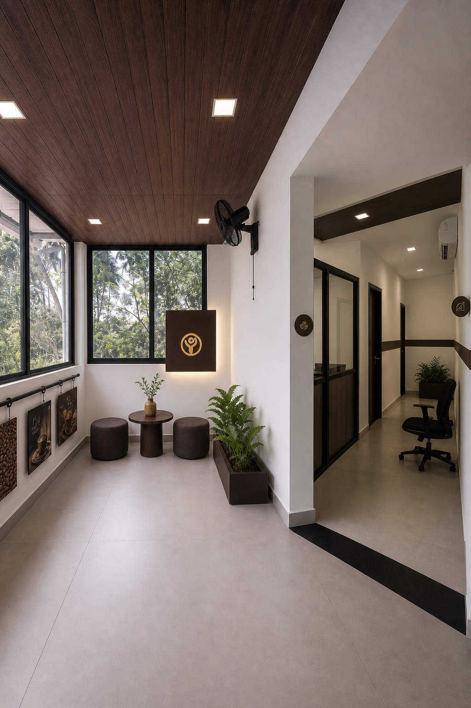 | Minimal welcome/brand layer with clear passage and retained shell. |

## Materials, FF&E and technical schedule

### Palette and fixed-shell response

| Element | Proposed specification / color | Location and reason |
|---|---|---|
| Existing dark wood ceiling | Retain; clean and locally repair; use a matte clear protective finish only after substrate check. | Window gallery and adjacent glazed frontage; it is the suite’s strongest existing warm material. |
| Floor | Retain pale tile; deep-clean grout; add non-slip, low-pile rug only in CEO meeting setting. | All spaces; keeps continuity and easy cleaning. |
| Metal | Matte black powder-coated steel. | Match existing black window and glass-partition frames. |
| Primary wood | Walnut/coffee-brown veneer or laminate with low-VOC edge banding. | Desks, monitor console and counter modifications. |
| Accent | Roasted coffee brown, warm cream, muted seed-gold. | Brand wall, upholstery and wayfinding; no large theme graphics. |
| Glazing | Existing clear glazing retained; 1.2 m frosted privacy film at CEO room; optional subtle film bands for lab zone identification. | Privacy and visual order without losing borrowed light. |
| Lab surfaces | Stainless steel or sintered stone at hot zone; washable compact laminate elsewhere. | Heat, jars, hygiene and cleanability. |
| Window control | Off-white solar roller shades or existing-blind replacement. | Gallery/lab glare and heat control without hiding trees. |

### Furniture, fixtures and equipment

| Ref | Item | Quantity | Proposed location | Procurement / installation note |
|---|---:|---:|---|---|
| F01 | 1400–1600 mm executive desk + cable tray | 1 | CEO office | Confirm door and guest-chair clearance. |
| F02 | Executive task chair | 1 | CEO office | Adjustable lumbar/arms. |
| F03 | Guest chairs | 2–4 | CEO office | Start with 2; add only after field measure. |
| F04 | Lockable CEO credenza | 1 | CEO office | Keep below glazing/privacy band. |
| F05 | Acoustic wall panels | 2–3 | CEO office | Do not cover high window/AC. |
| F06 | Frosted privacy film | 1 set | CEO glazing | 1.2 m band; verify landlord rules. |
| F07 | 1600 mm campaign desk | 1 | Marketing gallery | Orient perpendicular to glazing. |
| F08 | Two-person collaboration bench | 1 | Marketing gallery | Casters with locks preferred. |
| F09 | Tall lockable marketing kit cabinet | 1 | Opaque gallery end | 400–450 mm deep; keep egress clear. |
| F10 | Campaign rail / pin-up board | 1 | Gallery solid wall | Replaceable, not permanent wall damage. |
| F11 | Height-adjustable QC desk + dock | 1 | Lab, Sangeetha zone | Data/power under desk; no heat zone. |
| F12 | High-CRI QC task luminaire | 1–2 | Lab, sample review | 4000 K, CRI 90+, glare controlled. |
| F13 | Sample tray / labelled bin system | 1 set | Lab | Distinguish in-test, hold, approved and waste. |
| F14 | Under-counter sample cooling drawer | 1 | Lab | Conditional on circuit/ventilation approval. |
| F15 | Stainless/sintered hot-zone top | 1 run | Existing right counter | Verify substrate and appliance clearances. |
| F16 | Compact electric test appliance(s) | 1 set | Lab hot zone | Final make/model after mechanical/fire review. |
| F17 | Fire blanket + appropriate extinguisher | 1 set | Lab door approach | Coordinate category with local authority. |
| F18 | 55 in commercial displays | 3 | Central hall | VESA mount with anti-theft fixing. |
| F19 | Monitoring console / operator chair | 1 each | Central hall | 600 mm shallow console; preserve passage. |
| F20 | Lockable ventilated NVR/UPS cabinet | 1 | Central hall | Thermally managed; separate data/power. |

### Lighting, power, data and HVAC / ventilation

| System | Buildable design direction | Verify before work |
|---|---|---|
| Ambient light | Keep existing square downlights; target warm 3000–3500 K in CEO/marketing and neutral 4000 K in QC. Dimmable circuits improve screen work and product review. | Existing circuit zoning, ceiling access and emergency-lighting requirements. |
| Task light | Add desk task lighting at Nikhil/Roshan stations; add CRI 90+ neutral QC light at Sangeetha’s sample mat. | Glare, flicker, color-rendering test and mounting detail. |
| General power | Add accessible desk modules and cable trays; provide isolated dedicated circuits for displays/NVR/UPS and a separate labelled circuit for heat appliances. | Panel capacity, earthing, RCD/GFCI protection and local code. |
| Data | Cat6A home-runs to monitoring, Nikhil, Sangeetha and CEO desk; PoE-ready camera endpoints; patch panel/NVR cabinet in ops zone. | Existing telecom riser, Wi-Fi survey, cable route and cybersecurity policy. |
| Existing AC/fans | Retain and clean split AC/wall fans; balance airflow so paperwork and sample labels are not disturbed. | Load calculation, drainage, filter condition and condensate route. |
| Roasting/test extraction | A local capture hood or approved vented enclosure must exhaust heat/smoke/odors outdoors via a compliant route, with make-up air and fire-rated penetrations as applicable. **The AC and wall fan are not a substitute for process extraction.** | Landlord approval, outdoor discharge, duct route, fan static pressure, noise, fire suppression and food-safety rules. |

## Monitoring coverage, privacy and operations

1. **C1:** hall / entry common route, covering the monitoring console approach.
2. **C2:** gallery circulation and door approach; never zoomed onto Nikhil’s screen.
3. **C3:** lab entry and heat-equipment safety zone; not Sangeetha’s sample paperwork.
4. **C4:** striped-glass entry passage / door approach.

Use a password-managed NVR, named roles, automatic time synchronization, protected network VLAN, encrypted backup where supported, signage at entry, an access log, and a written retention/deletion policy. CCTV policy and consent requirements vary by jurisdiction; this package does not establish legal approval. The objective is common-area operational awareness, not continuous employee performance monitoring.

## Build sequence and field-verification checklist

1. **Measure first:** capture room dimensions, ceiling heights, sill heights, door swings, glass thicknesses, tile module, electrical panel/circuit capacity, data path, AC capacity and all water/waste points.
2. **Approve safety:** have a qualified mechanical/fire professional verify heat equipment, local exhaust, fire protection, appliance clearances, food-production compliance and any new sink.
3. **Test before fit-out:** mock up CEO privacy film height, monitor-wall viewing position and marketing clear path with tape/cardboard; daylight/glare test at Nikhil’s desk and CRI test at Sangeetha’s sample area.
4. **Build shell first:** repair/clean existing wood ceiling, tiles, glazing and blinds; install containment, power/data, ventilation and fire measures before furniture.
5. **Commission:** label all circuits/cables, balance HVAC/extraction, test monitor-wall camera views, test NVR/UPS runtime, inspect furniture clearances, and train the team on lab cleaning, fire response and video access.

## Deliverable inventory

```text
docs/roza-lab/
├── README.md                         # this GitHub-readable package
├── index.html                        # optional visual review board
├── generate_assets.py                # reproducible plates / diagram generation
├── diagrams/
│   ├── proposed-floor-plan.svg
│   └── monitoring-coverage.svg
├── survey/
│   ├── originals/P01.jpg … P13.jpg   # supplied photos preserved
│   └── directional-plates/P01…P13.jpg
└── visuals/
    ├── ceo-office.png
    ├── marketing-hub.png
    ├── qc-rd.png
    ├── roastery-test-lab.png
    ├── monitoring-station.png
    └── gallery-circulation.png
```

