# Roza Lab — Interior design package

Marketing HQ · central monitoring · small R&amp;D / roastery test kitchen

**Status:** evidence-based concept from 13 current-state photos. Not a measured survey.  
**Working orientation:** Window / Daylight axis = **Working North** (tree canopy at the sunroom). True geographic north is unverified.

---

## 1. Executive brief

Roza Lab is a compact suite for **Rozana / Roza** coffee and food R&amp;D sitting beside a marketing desk. The brief is not a generic open office. It has to hold three named people and one wet/heat function without mixing cooking into the CEO cabin:

| Person / function | Role | Spatial need |
|---|---|---|
| **Roshan Mahamood** | CEO | Private cabin, glass for visual connection, a view if possible |
| **Nikhil** | Marketing Head | Collaboration, campaign wall, next to the monitoring TV |
| **Sangeetha** | Nutritionist / QC / R&amp;D | Lab bench, samples, QC lighting, next to cook-test |
| **Roastery cook test** | Heat / smell / wet-dry | Extractor, wipeable surfaces — **not** in the CEO cabin |
| **Central TV** | Whole-suite overview | Solid-wall mount, cameras covering hall, corridor, lab, cabin, sunroom |

The photos already show the right envelope: a **wood-ceiling sunroom** at the daylight end, a **white-ceiling inner spine**, a **glass + vertical-slat lab** with butcher-block and red-lid jars, and a **compact glass executive cabin**. The proposal keeps those partitions and reprograms them.

---

## 2. How the layout was reconstructed

Handheld photos, not registered panoramas. Methods below are borrowed from high-star GitHub room-layout work and applied **manually** (no ML weights were run on these JPEGs).

### Repositories cited

| Repository | Stars (GitHub search, 2026-09) | Method borrowed |
|---|---:|---|
| [art-programmer/FloorplanTransformation](https://github.com/art-programmer/FloorplanTransformation) | 678 | Treat rooms as labeled polygons; raster-to-vector thinking (walls, doors, openings as a graph) |
| [sunset1995/HorizonNet](https://github.com/sunset1995/HorizonNet) | 370 | Manhattan alignment: assume walls meet at right angles; use vanishing lines of tiles, ceiling beams, window mullions |
| [ywyue/RoomFormer](https://github.com/ywyue/RoomFormer) | 333 | Semantic room types + openings (door / window / glass) predicted as structured polygons — used here as a **zone program** on evidenced rooms only |
| [zouchuhang/LayoutNetv2](https://github.com/zouchuhang/LayoutNetv2) | 237 | Single-image layout: floor/wall/ceiling junctions, vanishing-point “up” vector |

Also noted (lower stars, high method value): [zillow/salve](https://github.com/zillow/salve) (SALVe, ECCV 2022) — **pairwise alignment of sparse indoor views** via doors, windows, and openings; [crs4/Indoor-floor-plans-prediction](https://github.com/crs4/Indoor-floor-plans-prediction) (NadirFloorNet) — multi-view floor projections in one plan frame.

### Applied to these 13 photos

1. **Multi-view correspondence (SALVe-style).** Landmarks that repeat: black stone threshold, Crompton wall fan, split AC, grey fridge, glass + wood-slat lab door, executive desk with horizontal light slats, red-lid jars, far tree window.
2. **Vanishing-point / Manhattan grid (HorizonNet / LayoutNet).** Corridor tiles and ceiling beam set a N–S spine. Sunroom long axis is E–W. Plan is orthogonal; no diagonal rooms were invented.
3. **Zone programming (RoomFormer).** Only volumes visible in at least one photo are drawn. The solid wood door on the east of the corridor is shown as **unverified** — the room behind it was not photographed.
4. **Tile module as a nadir scale.** Large-format tiles read as **600 × 600 mm** (typical South Asian vitrified module). Counts are approximate.

### Working compass (assumption — state this on every drawing)

True north is **unknown**. A **Working North** is assigned to the **brightest tree-facing glazing**: the sunroom’s north wall and east end. Walking from the open hall toward that daylight is walking **Working North**.

| Working | What you face | Evidence |
|---|---|---|
| **N** | Sunroom, tropical trees, wood-plank ceiling | P01, P02, P08, P11 — far foliage; P09/P10 look the opposite way, back into the white-ceiling suite |
| **E** | Lab, windows with vertical blinds | P05, P06 look into the lab; L-counters and jars |
| **W** | Glass cabin, fridge, AC, cabin’s small high window | P03, P07 inside cabin; P01 cabin on the left when facing N |
| **S** | Open hall / likely building-core entry | P01 camera stands here looking N |

If a later survey shows the garden elevation is actually east or west, **rotate the whole drawing**; relative room adjacencies stay the same.

---

## 3. Photo index (every current photo)

Files live in [`photos/current/`](photos/current/). Camera facing uses **Working** compass.

### P01 — Inner hall, facing Working North

| | |
|---|---|
| File | `P01_inner_hall_facing_north.jpg` |
| Camera | Open hall / south end of spine, **facing N** |
| Shows | Glass cabin to the **west (left)**; solid wood door to the **east (right)**; grey fridge + split AC on the west corridor wall; far sunroom window and wood-plank ceiling |

### P02 — Corridor, facing Working North

Same spine as P01, tighter crop. Confirms fridge/AC pairing and the daylight terminus.

### P03 — Executive glass cabin, facing Working West

Compact cabin: dark desk with horizontal light slats, **three** black chairs, laptops, plant/bean samples, wall power strip, **narrow high window with trees** on the far wall, glass door with D-handle. Proposed as **CEO (Roshan Mahamood)**.

### P04 — Side hall, facing Working North

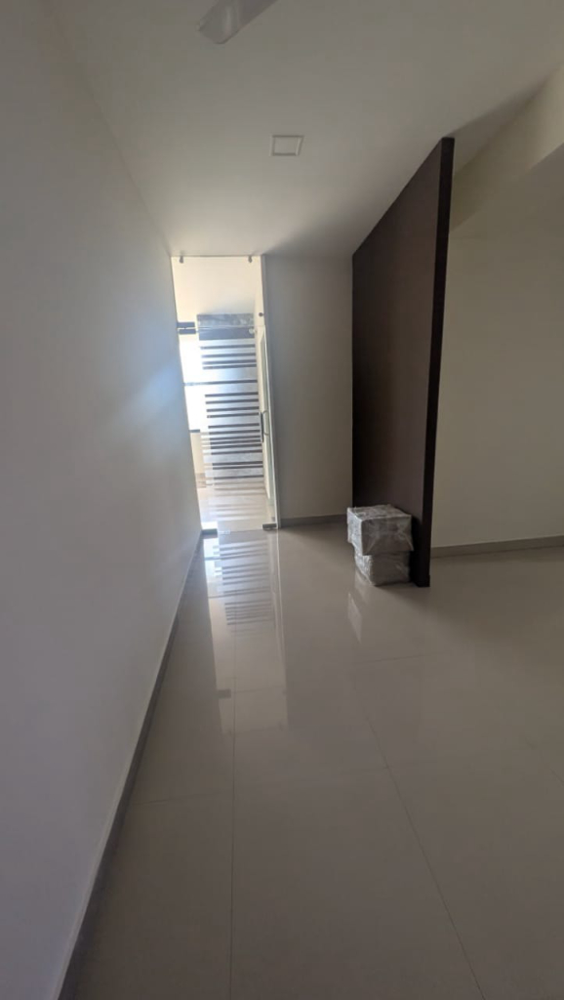

Narrower view toward the bright threshold. Dark full-height wood partition on the right; wrapped panels on the floor; ceiling-fan blade at the top of frame.

### P05 — Lab from corridor, facing Working East

Black-framed partition, **vertical wood slats below / glass above**, hydraulic closer. Inside: L-shaped butcher-block, microwave, red-lid jars, mesh chair, ceiling fan, **east windows with beige vertical blinds**. This is Sangeetha’s existing bench.

### P06 — Lab from corridor, facing Working East (alt)

Same room as P05. Adds kettle and sink line under the blinds — the natural **cook-test / wet** end of the lab.

### P07 — Executive cabin, facing Working West (alt)

Second take of P03. Same cabin, same window, same desk.

### P08 — Sunroom, facing Working East

Long narrow balcony-office: **dark wood-plank ceiling**, square LED panels, **black-framed windows on the north wall and east end**, Crompton fan on the **south** solid wall, black stone threshold at the south opening, one mesh chair.

### P09 — Threshold, facing Working South

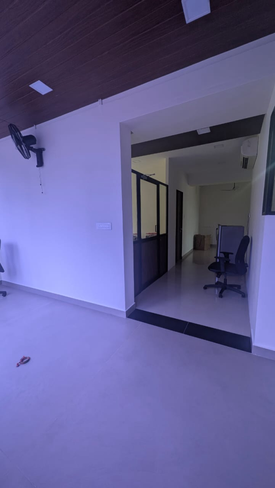

Standing in the sunroom looking **into** the inner suite. Wood ceiling in the foreground; white ceiling beyond. Lab glass+slats on the **east (left)**; fridge + AC on the **west (right)**. This is the reverse of P01/P02 and locks the topology.

### P10 — Threshold, facing Working South (alt)

Same node as P09. Confirms black granite threshold as the public/private joint.

### P11 — Sunroom, facing Working East (alt)

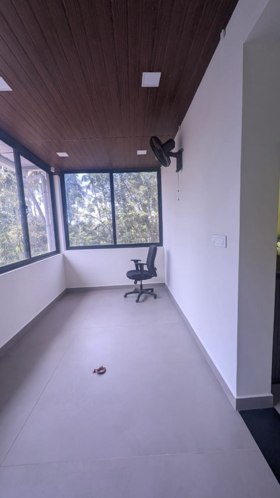

Same as P08; chair toward the east window.

### P12 — Sunroom, facing Working West

Opposite of P08. Solid west end wall; doorway + threshold on the **south (left)**; windows on the **north (right)**; Crompton fan on the south wall; interior viewing pane beside the opening.

### P13 — Sunroom, facing Working West (alt)

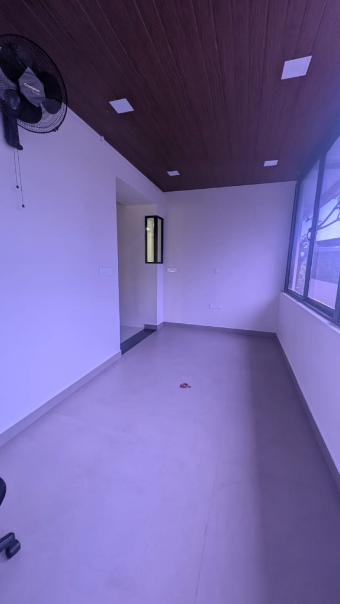

Same as P12. Power/data plates on the south and west walls.

**Photo → plan map:** use [`plans/current-layout.svg`](plans/current-layout.svg). Generated raster `visuals/current-floor-plan.png` is atmospheric only — **trust the SVG and this table for camera numbers**, not the raster’s extra labels.

---

## 4. Current-state layout (with directions)

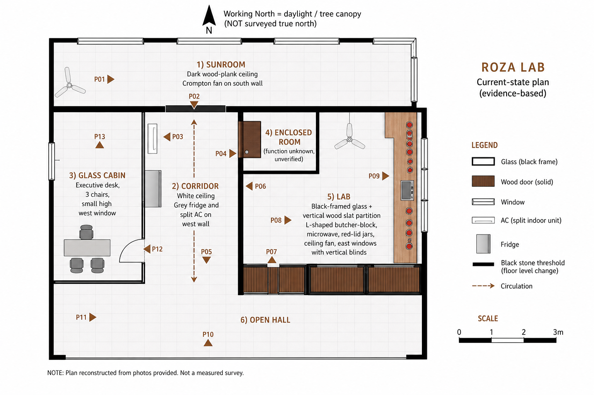

*Illustration above is a design visual. Room names and P-numbers on the SVG + §3 table are authoritative.*

### What is evidenced (do not add rooms)

| Zone | Ceiling | Envelope | Fixed MEP / FF&amp;E |
|---|---|---|---|
| Sunroom | Dark wood planks | N + E black-framed windows; S solid wall with fan and wide opening | Crompton wall fan, square LED panels, black stone threshold |
| Corridor | White | N–S spine | Split AC + grey fridge on **west** wall |
| Glass cabin | White | Glass to corridor; small high **west** window | Executive desk, 3 chairs, desk-height power/data |
| Lab | White + fan | Glass + vertical slats to corridor; **east** windows + blinds | Butcher-block L, microwave, kettle, red-lid jars, sink line |
| Open hall | White + bulkhead | South of cabin/corridor | Recessed square LEDs |
| Solid wood door (east) | — | Leaf visible from corridor | **Interior not photographed** |

### Annotated circulation (camera facing Working North)

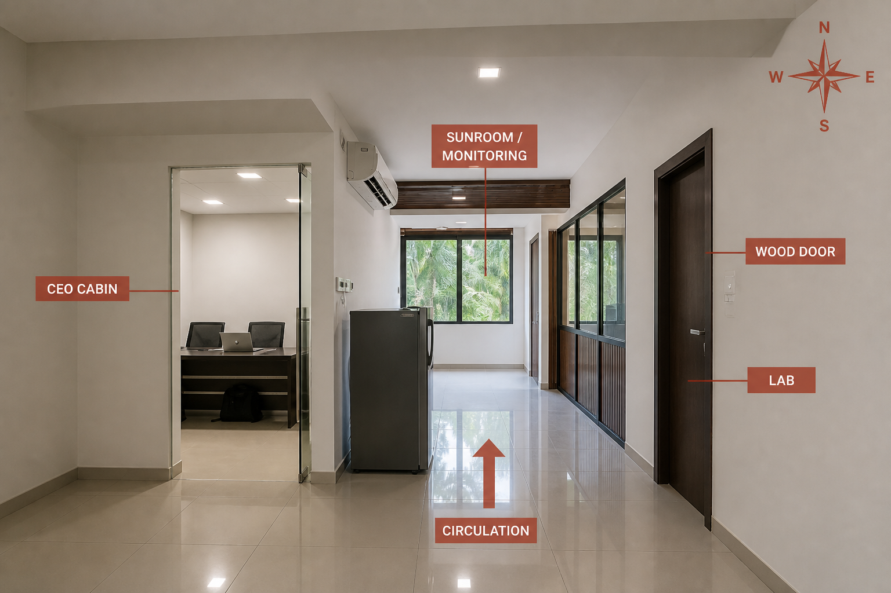

Walking **N**: CEO cabin left (W) → fridge/AC → threshold → sunroom. Lab / wood door on the right (E). Reverse of P09.

A second composite from the threshold node is in [`visuals/reception-circulation-directions.png`](visuals/reception-circulation-directions.png) (wood-ceiling lounge in the foreground). Prefer the north-facing overlay above if the two disagree on left/right.

---

## 5. Proposed zoning

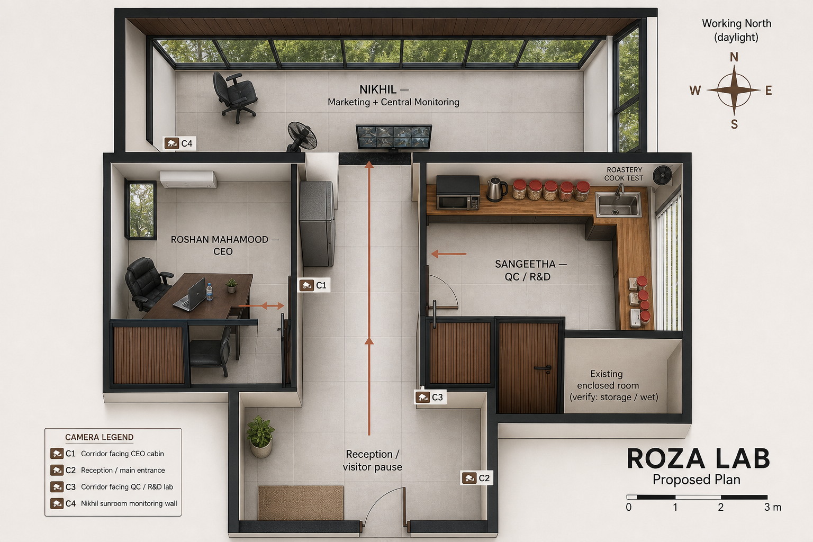

Existing glass, slats, wood ceiling, and threshold **stay**. Furniture and a TV wall move. No new wings.

### 5.1 Roshan Mahamood — CEO cabin (existing glass cabin, west)

**Keep** the cabin. It already has privacy, corridor glass, and a foliage window.

- Keep the slatted executive desk; add a low walnut credenza on the south or north wall (not in the window).
- Visitor chair stays; avoid a fourth seat — the room is tight.
- Frost or a linen drape on the lower glass if calls need visual privacy; keep upper glass clear so the TV operator can still see occupancy.
- **No induction, kettle, or sample cook here.**

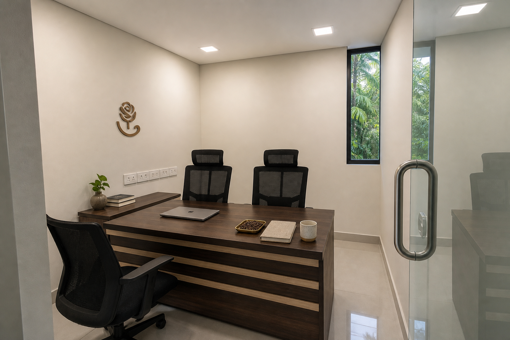

### 5.2 Nikhil — Marketing Head + central monitoring (sunroom)

The sunroom is the only room with a long solid wall **and** a campaign-length window.

- **Campaign table** along the **north** glazing (daylight for print/pack review). Pin-up / fabric board for Roza packaging (kraft, cream, coffee-brown — not navy-and-neon tech).
- **65" TV** on the **south solid wall**, east of the Crompton fan, above a slim console. This wall does not steal window.
- Two task chairs, not a sofa farm. The room is a balcony width (~2.4 m).
- Keep the fan. Add a silent split or cassette later if the TV wall loads the south wall thermally — do not brick the north glass.

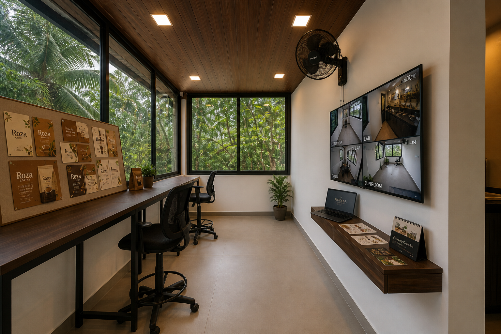

### 5.3 Sangeetha — Nutritionist / QC / R&amp;D (existing lab, north/east counters)

Keep the L-bench. Upgrade lighting and hygiene, do not replace the partition.

- **4000–5000 K** under-cabinet LED for colour of roast and inclusions (existing square panels are too cool and too high).
- Scale, clipboard, sealed jar rows, wipeable backsplash.
- Chair stays at the dry return (west/north), away from the sink.

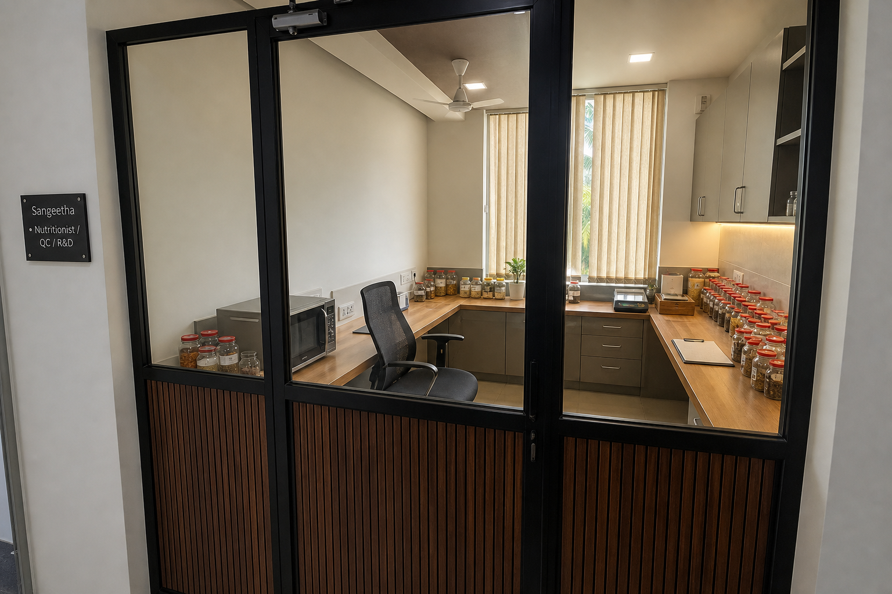

### 5.4 Roastery cooking testing (south/east of the same lab)

Heat stays **inside the lab envelope**, at the window/sink end already holding microwave, kettle, and jars. Not a new room; a wet/heat **zone**.

- Portable induction + stainless splash + **recirculating or short-throw canopy** over the hob (confirm landlord exhaust).
- Wet: sink. Dry: jars and scale on the north run.
- Door closer already on the slat door — keep it shut when roasting. If smell still crosses the spine, add a simple drop-seal and a small transfer fan to the east window (not into the CEO cabin).
- The unverified wood-door room is **only** a candidate for sealed waste/chemical store after it is photographed and checked for plumbing.

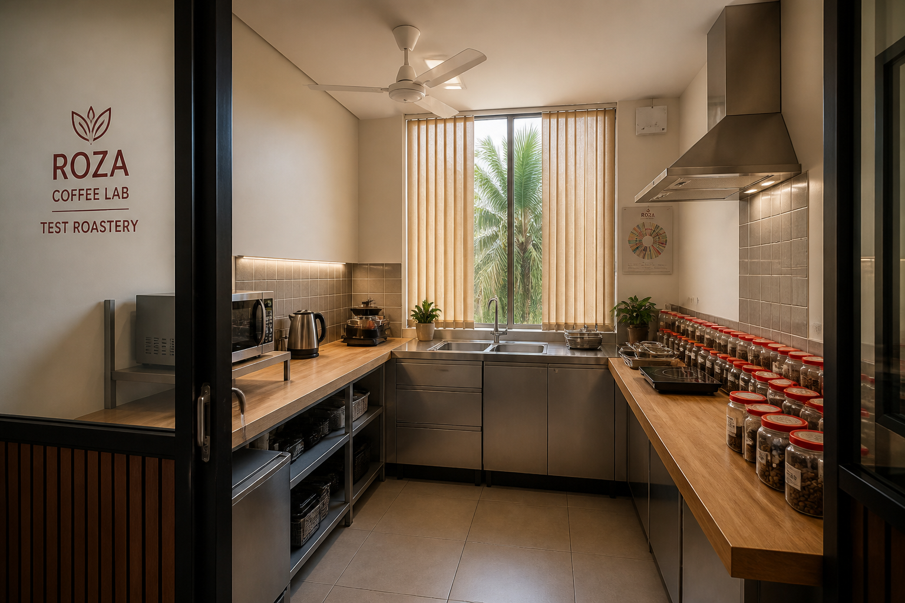

### 5.5 Reception / threshold / storage

- **Reception / visitor pause** in the south open hall: two chairs, plant, Roza mark. Clear sightline north to the sunroom.
- **Threshold** remains the material cue: wood-ceiling “front of house” vs white-ceiling “work”.
- **Fridge** stays on the west corridor wall (staff water/samples — not a display case).
- Storage: credenzas in cabin and sunroom first; do not block the 1.8 m spine.

---

## 6. Furniture, finishes, lighting, MEP

Pulled from the photos, then specified.

| Layer | Existing (keep) | Proposed |
|---|---|---|
| Floor | Light large-format tiles, ~600 mm, high gloss in hall / matte in sunroom | Keep. Add washable mat at cook zone only |
| Walls | Off-white plaster | Keep. Coffee-brown vinyl mark at hall and lab door |
| Sunroom ceiling | Dark wood planks + square LEDs | Keep. Do not paint |
| Inner ceiling | White + square LEDs; lab ceiling fan | Keep fan; add 4000–5000 K task at lab |
| Partitions | Black-framed glass; vertical wood slats; frameless cabin glass; solid wood door | Keep. Drop-seal on lab door |
| Windows | Black frames; tropical trees; lab blinds | Keep blinds on lab (east glare). Do not film sunroom north glass |
| Power | Cabin desk-height strip; sunroom south/west plates | Add 2× 16 A at cook zone; data at TV console |
| Cooling | Corridor split AC; Crompton wall fan | Service AC; do not relocate on day one |
| Brand | — | Warm brown / cream / kraft / black metal. Tropical green outside. **Not** grey-glass Silicon Valley |

**Food-lab safety (small, but non-negotiable)**

- Heat and smell isolated by the existing slat door + extractor at the hob.
- Wipeable splash at wet/heat; wood butcher-block is acceptable on the **dry** QC run if oiled and kept out of the splash zone — stainless at the sink.
- No open flame. Induction only unless a gas permit exists (none visible).
- Hand-wash at the lab sink before jar work. Fridge: samples labelled, no mixed staff lunch on the same shelf as retain samples.

---

## 7. TV monitoring plan

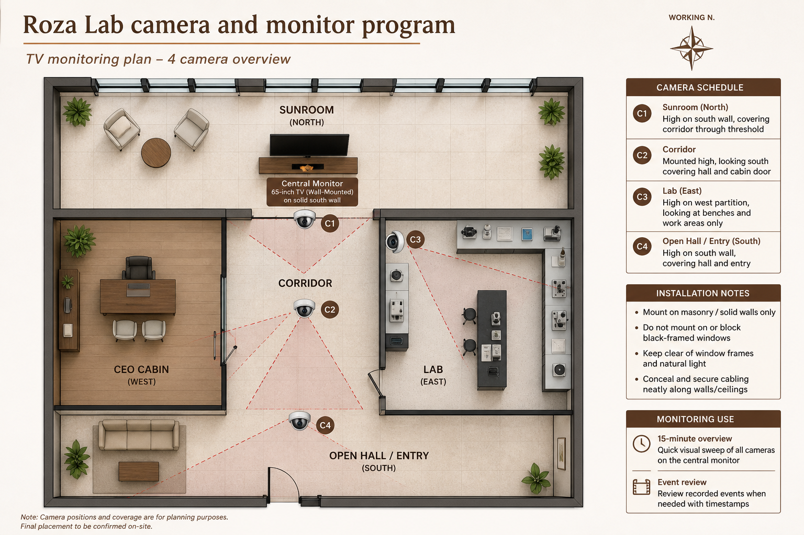

Leadership should see **the whole office** from Nikhil’s south wall, without covering windows.

| ID | Mount (solid wall) | Looks toward | Why |
|---|---|---|---|
| **C1** | Sunroom south wall, high, west of TV | Working N / threshold | Spine + who enters the sunroom |
| **C2** | Corridor west bulkhead, south of AC | Working S | Hall, fridge, CEO door |
| **C3** | Lab west head (partition masonry/frame, not glass pane) | Working E | Benches and cook zone |
| **C4** | Open hall west or south solid wall | Entry / visitor pause | Arrival |

**TV:** 65" landscape, 2×2 grid labelled Corridor / Lab / Cabin / Sunroom. Optional fifth PIP later — four cameras already cover the evidenced rooms.

**Do not:** mount on mullions or the north/east glass; aim at neighbours or the street; record audio until a written policy exists; put a camera in any future washroom behind the unverified wood door.

**Use:** 15-minute live overview on the sunroom TV; event review from an NVR in a ventilated cabinet (sunroom console or corridor high shelf), not in the cook zone.

---

## 8. Proposed visualizations

All generated images match the photo materials: off-white walls, large-format tiles, dark wood ceiling, black frames, vertical slats, tropical trees, Roza coffee-brown — not a Bay Area loft.

| Visual | File |
|---|---|
| Proposed plan | [`visuals/proposed-floor-plan.png`](visuals/proposed-floor-plan.png) |
| CEO — Roshan | [`visuals/ceo-roshan-cabin.png`](visuals/ceo-roshan-cabin.png) |
| Nikhil + TV wall | [`visuals/nikhil-marketing-monitoring.png`](visuals/nikhil-marketing-monitoring.png) |
| Sangeetha QC | [`visuals/sangeetha-qc-rd-bench.png`](visuals/sangeetha-qc-rd-bench.png) |
| Roastery cook test | [`visuals/roastery-cook-test.png`](visuals/roastery-cook-test.png) |
| Reception / directions | [`visuals/circulation-facing-north.png`](visuals/circulation-facing-north.png), [`visuals/reception-circulation-directions.png`](visuals/reception-circulation-directions.png) |
| Current plan illustration | [`visuals/current-floor-plan.png`](visuals/current-floor-plan.png) |
| Camera program | [`visuals/tv-monitoring-plan.png`](visuals/tv-monitoring-plan.png) |

HTML booklet: [`index.html`](index.html).

---

## 9. Implementation phasing

Keep glass/wood partitions. Build in place.

| Phase | Work | Notes |
|---|---|---|
| **0 — Measure** | Laser the tile grid, confirm wood-door room, confirm extract path | Until then, sqm is ±20% |
| **1 — Hygiene + heat** | Lab splash, induction, extractor, drop-seal, sample fridge rules | Unlocks Sangeetha + cook test |
| **2 — Monitoring** | C1–C4, NVR, 65" on sunroom south wall, console | Cabling in existing bulkheads; no window chasing |
| **3 — Desks** | Nikhil campaign table; tidy CEO credenza; reception two chairs | Reuse black mesh chairs from photos |
| **4 — Brand + light** | Marks, QC task lights, optional lower-glass film on CEO | After furniture so holes are once |

---

## 10. Assumptions and open items

| Item | Assumption | Open |
|---|---|---|
| North | Working N = sunroom tree glazing | Confirm with compass / site plan |
| Area | ~55–70 m² from 600 mm tiles | Laser survey |
| Entry | South hall is the arrival from the building core | Confirm fire escape and actual door |
| Wood door room | Exists; contents unknown | Photograph before programming |
| Exhaust | Recirculating hood acceptable | Landlord / grease / smell rules |
| Cameras | Staffed office overview, no audio | Written privacy policy |
| Location | Tropical South Asian greenery in photos | Street address not in this package |
| Generated rasters | Mood and material, not construction drawings | SVG + photo table override if they clash |

---

## Named-person summary

- **Roshan Mahamood (CEO):** existing west glass cabin — private desk, glass to the spine, small west tree window. No cook equipment.
- **Nikhil (Marketing):** sunroom — campaign table on the north glass, 65" monitoring wall on the south solid wall, beside the Crompton fan.
- **Sangeetha (QC / R&amp;D):** existing east lab — dry L-bench, jars, QC lighting, next to the cook-test end of the same room.
- **Roastery cook test:** window/sink end of the lab — induction, extractor, wet/dry split, door closed when hot.

*Roza Lab interior package · reconstructed 2026-09 from 13 site photos · working north = daylight / trees.*
